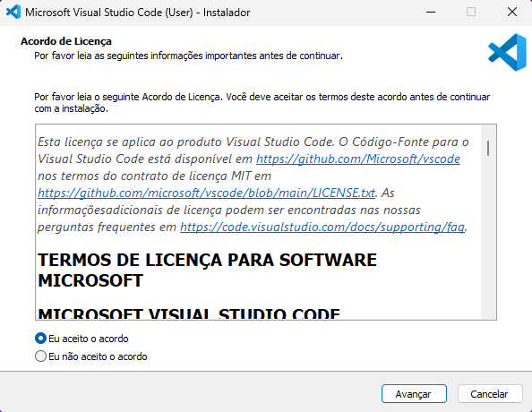
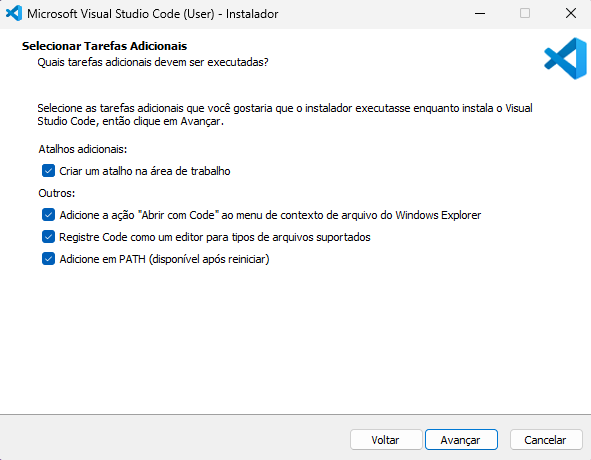
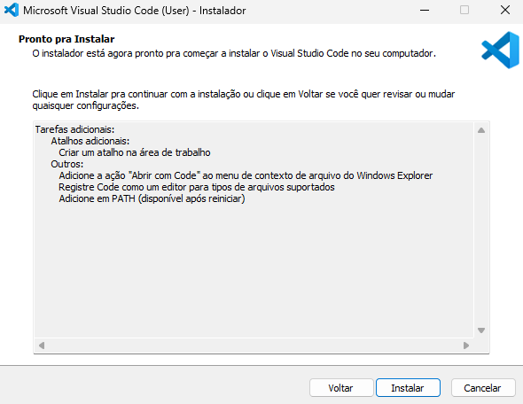
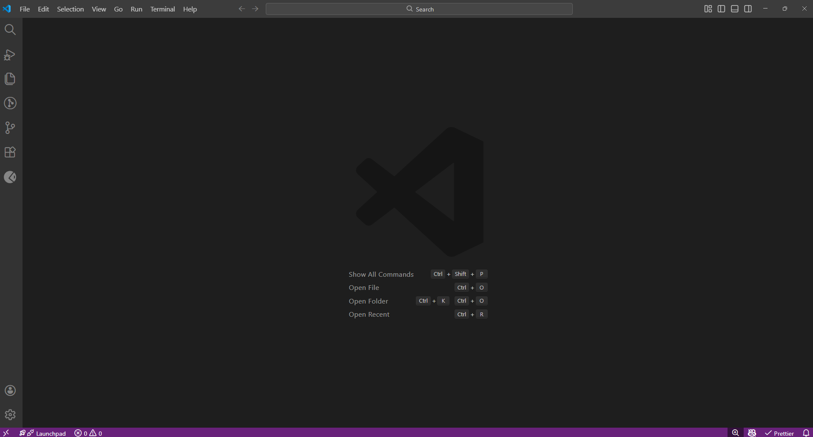
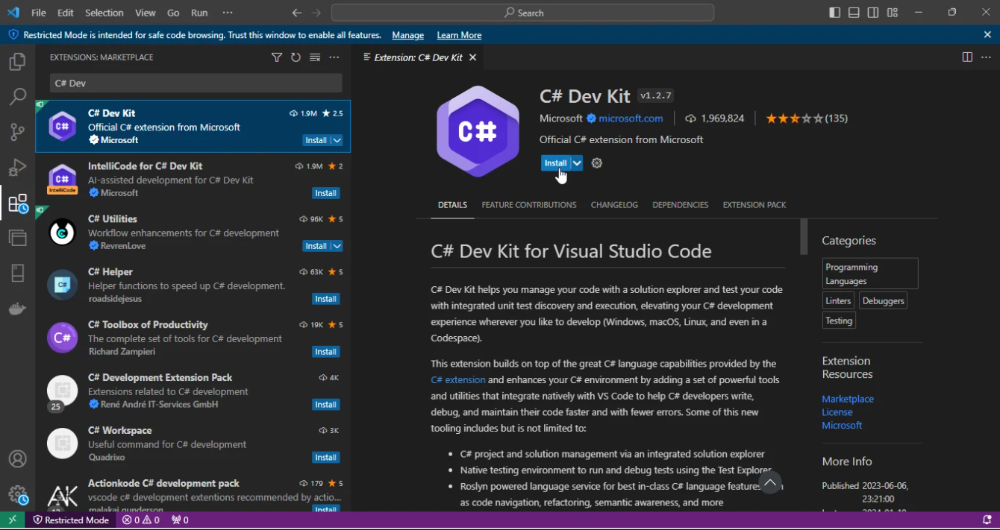

O **Visual Studio Code (VS Code)** é uma IDE (ou editor de código avançado) leve, gratuita e multiplataforma, desenvolvida pela Microsoft. Ele permite desenvolver aplicações em diversas linguagens, incluindo C#.

Para desenvolvimento com C#, é altamente recomendado instalar a extensão **C# Dev Kit**, que adiciona suporte completo a projetos .NET, incluindo IntelliSense, depuração (debug), gerenciamento de soluções e integração com o .NET SDK.

> ⚠️ Antes de continuar, certifique-se de que o **.NET SDK** já está instalado na sua máquina.

---

## Download

Para baixar o VS Code:

1. Acesse a página oficial em https://code.visualstudio.com/.

2. Clique no botão de download correspondente ao seu sistema operacional (Windows, macOS ou Linux).

3. Execute o instalador.

## Instalação

1. Leia e aceite o acordo de licença do Visual Studio Code para prosseguir.



2. Selecione as seguintes opções de instalação:



3. Confirme a instalação.



## Inicializando o Visual Studio Code

Após a instalação, você poderá abrir o VS Code pelo menu iniciar ou digitando no terminal (em uma pasta):

```sh
code .
```

Ao abrir o VS Code você deve ver uma tela similar a esta:



## Extensão C# Dev Kit

A extensão C# Dev Kit é o conjunto oficial da Microsoft para desenvolvimento moderno em C# dentro do Visual Studio Code.

Ela transforma o VS Code em uma experiência muito mais próxima do Visual Studio completo, especialmente para projetos .NET.

### Instalação

Com o VS Code aberto:

1. Clique no ícone de Extensões no menu lateral esquerdo
   (ou utilize o atalho Ctrl + Shift + X).
2. Pesquise por:

```text
C# Dev Kit
```

3. Clique em Instalar.


