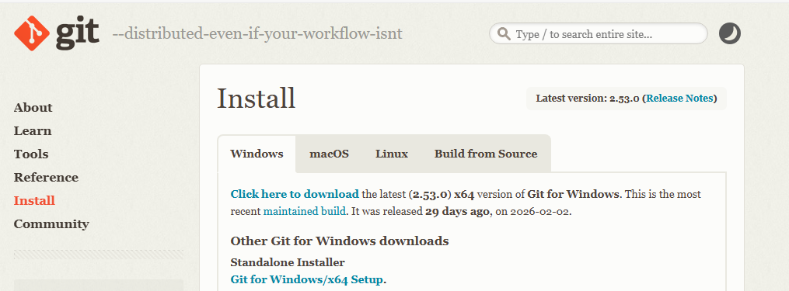
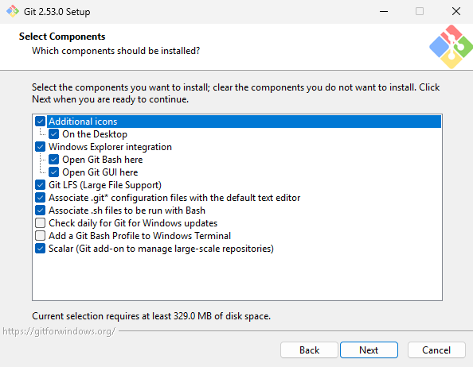
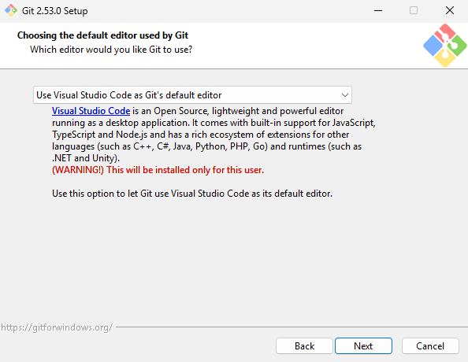
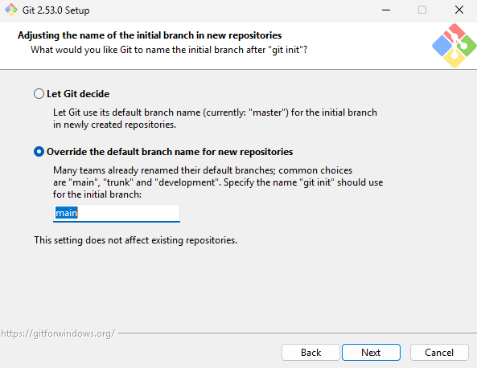
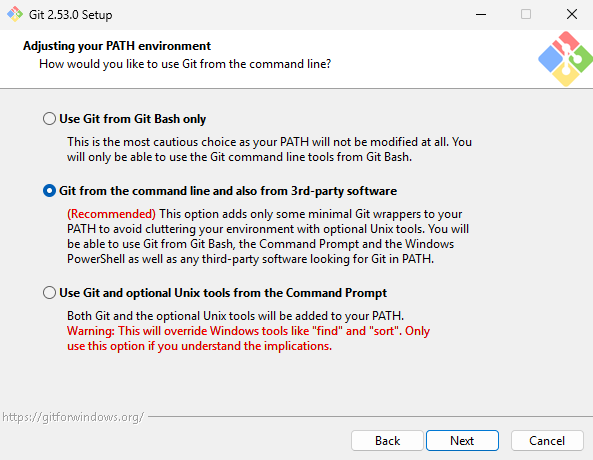

O **Git** é um sistema de controle de versão distribuído utilizado para rastrear alterações no código-fonte ao longo do tempo. Ele permite que desenvolvedores trabalhem em equipe, criem versões do projeto e mantenham um histórico completo das modificações realizadas.

O Git é essencial para qualquer projeto profissional e é utilizado em conjunto com plataformas como GitHub, GitLab e Azure DevOps.

## Download



1. Acesse o site oficial em https://git-scm.com/.

2. Clique em **Download for Windows**.

3. Execute o instalador.

## Opções de Instalação

Durante a instalação, recomenda-se:

- [x] Ícones adicionais no Desktop



- [x] Usar o Visual Studio Code como editor padrão



- [x] Sobrescrever o nome de branch padrão de "master" para "main"



- [x] Selecionar "Git from the command line and also from 3rd-party software"



- [x] Manter as configurações padrão nas demais opções

## Verificando a Instalação

Após a instalação, abra um terminal (Prompt de Comando, PowerShell, Bash ou Terminal do VS Code) e execute:

```bash
git --version
```

## Configuração Inicial (Obrigatória)

Antes de usar o Git, configure seu nome e email (essas informações ficam registradas nos commits):

```cs
git config --global user.name "Seu Nome"
git config --global user.email "seuemail@exemplo.com"
```

Para conferir as configurações:

```cs
git config --list
```
