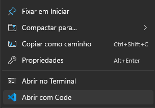
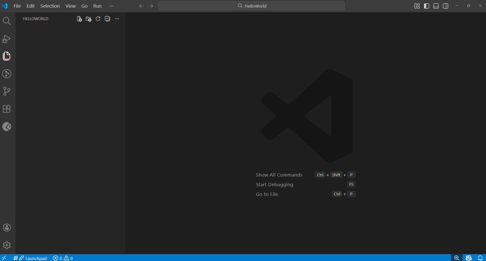
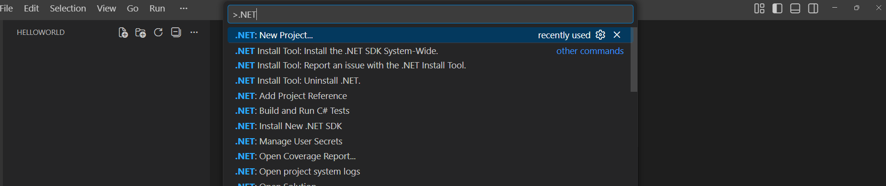
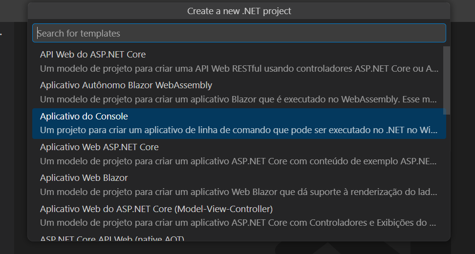
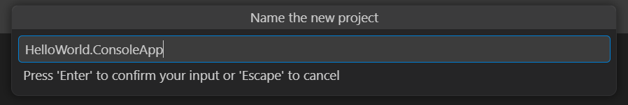
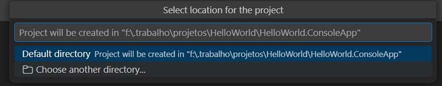
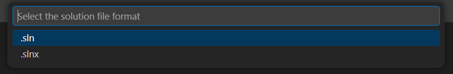
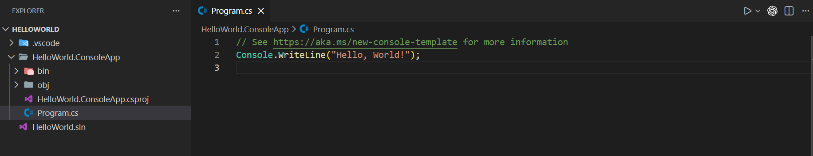
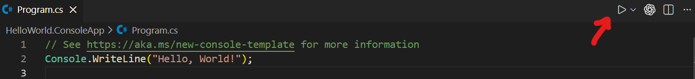
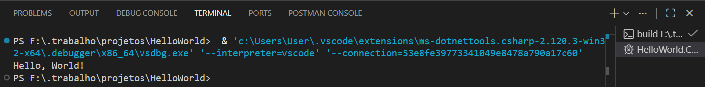

"Hello World" (Olá, Mundo) é o programa de computador mais simples e clássico, usado para exibir essa frase na tela, servindo como o primeiro passo no aprendizado de qualquer linguagem de programação.

## Criando a Solução

Em um local acessível, crie uma pasta chamada `HelloWorld`, este será o nome da nossa solução.

Clique com o botão direito do mouse na pasta criada, ao avançar para o menu de contexto, clique em `Abrir com Code`.

Sua tela deve estar assim:

## Criando um projeto através da Paleta de Comandos

Agora abra a Paleta de Comandos do Visual Studio Code utilizando o atalho `CTRL + SHIFT + P`, isso permite que encontremos comandos e configurações padrão ou de terceiros.

1. Digite `.NET` para acessar os comandos da extensão `C# Dev Kit`.
2. Selecione a opção `.NET: New Project`.

A tela de seleção de template será aberta, aqui você pode selecionar que tipo de projeto irá ser criado, as opções disponíveis dependem dos `workloads` instalados com a `SDK`.

2. Selecione "Aplicativo do Console"

3. No próximo prompt, você deve nomear o projeto que está criando, neste caso digitaremos `HelloWorld.ConsoleApp`

4. Agora selecione a pasta onde o projeto será criado, como já criamos a pasta da solução `HelloWorld`, manteremos o padrão.

5. No proximo prompt, selecione o tipo de solução `sln` (padrão pré .NET 10).

6. Confirme a criação do projeto e as configurações serão criadas.

## Execução do Projeto

Agora que o nosso projeto de aplicativo do console está criado, o .NET automaticamente cria um arquivo Program.cs que será o "ponto de partida" da nossa aplicação.

Execute o projeto clicando no botão no canto superior direito:

O código gerado deve escrever a frase "Hello World" ao executar o programa.

Parabéns, essa é sua primeira execução de um programa em C#!
