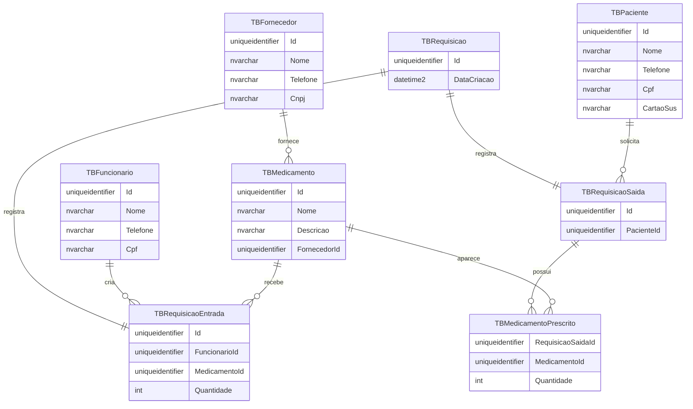
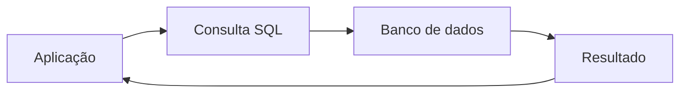
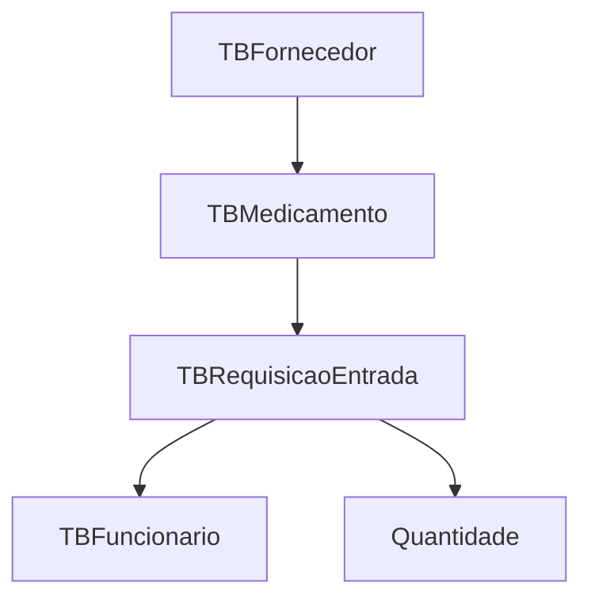

## SQL Básico

Até agora, vimos várias partes de uma aplicação web.

- telas;
- controllers;
- services;
- repositórios;
- validações;
- e troca de dados entre camadas.

Mas existe uma pergunta muito importante por trás de tudo isso:

> onde os dados ficam guardados de verdade?

Na maioria dos sistemas, a resposta é um banco de dados.

E, para conversar com esse banco, usamos uma linguagem chamada **SQL**.

SQL significa **Structured Query Language**.

Em português, podemos entender como:

> uma linguagem para consultar e manipular dados organizados em tabelas.

## O que é SQL?

O SQL é a linguagem usada para dizer ao banco o que queremos fazer.

Com SQL, podemos:

- buscar dados;
- inserir novos registros;
- alterar informações existentes;
- excluir registros;
- e consultar relações entre tabelas.

Pense no SQL como uma forma de fazer perguntas ao banco.

Por exemplo:

- “quais medicamentos existem?”
- “quem é o fornecedor desse medicamento?”
- “quais pacientes têm requisições?”
- “quais itens estão ligados a uma requisição de saída?”

## Como pensar em um banco de dados

Um banco de dados relacional organiza as informações em **tabelas**.

Cada tabela guarda um tipo de informação.

No schema de exemplo do projeto `ControleDeMedicamentosWeb`, temos tabelas como:

- `TBFornecedor`;
- `TBPaciente`;
- `TBFuncionario`;
- `TBMedicamento`;
- `TBRequisicao`;
- `TBRequisicaoEntrada`;
- `TBRequisicaoSaida`;
- `TBMedicamentoPrescrito`.

Uma tabela funciona de forma parecida com uma planilha:

- as **colunas** representam os campos;
- as **linhas** representam os registros;
- cada registro representa um item real do sistema.

### Exemplo visual



Esse diagrama ajuda a visualizar duas coisas:

- quais tabelas existem;
- como elas se relacionam.

## Tabela, linha e coluna

Vamos simplificar:

- **tabela**: conjunto organizado de dados;
- **coluna**: característica de cada dado;
- **linha**: um registro específico.

Por exemplo, na tabela `TBFornecedor`:

- `Id` identifica o fornecedor;
- `Nome` guarda o nome;
- `Telefone` guarda o contato;
- `Cnpj` guarda o documento da empresa.

Um registro poderia ser assim:

| Id | Nome | Telefone | Cnpj |
| --- | --- | --- | --- |
| 11111111-1111-4111-8111-111111111111 | Fornecedor Exemplo | (11) 99999-9999 | 12345678000199 |

Em outras palavras:

> uma linha é “uma coisa concreta” dentro da tabela.

## O fluxo de uma consulta SQL

Quando uma aplicação quer dados, o processo costuma seguir esta ideia:



Funciona assim:

1. a aplicação monta a consulta;
2. o banco recebe o comando;
3. o banco executa a operação;
4. o resultado volta para a aplicação;
5. a aplicação usa esses dados na tela ou em outra regra.

## Os comandos mais comuns

Existem vários comandos SQL, mas no começo vale entender os principais.

### `SELECT`

`SELECT` serve para **buscar dados**.

Exemplo:

```sql
SELECT [Nome], [Telefone]
FROM [dbo].[TBFornecedor];
```

Esse comando diz:

> “me mostre o nome e o telefone de todos os fornecedores.”

Se quisermos filtrar um único fornecedor:

```sql
SELECT [Nome], [Telefone], [Cnpj]
FROM [dbo].[TBFornecedor]
WHERE [Id] = '11111111-1111-4111-8111-111111111111';
```

O `WHERE` serve para limitar os resultados.

Ele funciona como uma peneira:

> só passam as linhas que atendem à condição.

### `INSERT`

`INSERT` serve para **inserir novos dados**.

Exemplo:

```sql
INSERT INTO [dbo].[TBPaciente] ([Id], [Nome], [Telefone], [Cpf], [CartaoSus])
VALUES (
    '44444444-4444-4444-8444-444444444444',
    'Paciente Exemplo',
    '(11) 97777-7777',
    '10987654321',
    '123456789012345'
);
```

Esse comando cria uma nova linha na tabela.

Em linguagem simples:

> estamos dizendo ao banco: “guarde este novo paciente”.

### `UPDATE`

`UPDATE` serve para **alterar dados que já existem**.

Exemplo:

```sql
UPDATE [dbo].[TBPaciente]
SET [Telefone] = '(11) 96666-6666'
WHERE [Id] = '44444444-4444-4444-8444-444444444444';
```

Aqui estamos mudando o telefone de um paciente específico.

O cuidado principal é usar o `WHERE`.

Sem ele, o banco pode atualizar todas as linhas da tabela.

### `DELETE`

`DELETE` serve para **remover dados**.

Exemplo:

```sql
DELETE FROM [dbo].[TBMedicamentoPrescrito]
WHERE [RequisicaoSaidaId] = '66666666-6666-4666-8666-666666666666';
```

Esse comando apaga registros da tabela.

Assim como no `UPDATE`, o `WHERE` é muito importante.

Sem ele, poderíamos remover tudo da tabela sem querer.

## O que é chave primária?

Cada tabela precisa de uma forma de identificar suas linhas.

Essa identificação é feita pela **chave primária**.

No schema do projeto, a maioria das tabelas usa `Id` como chave primária.

Ela serve para dizer:

> “este registro é único”.

Por exemplo, dois fornecedores não devem ter o mesmo `Id`.

Isso ajuda o banco a:

- evitar duplicidade;
- localizar registros com rapidez;
- manter a organização dos dados.

## O que é chave estrangeira?

A **chave estrangeira** é um campo que aponta para outra tabela.

Ela existe para mostrar relacionamento entre dados.

Por exemplo, em `TBMedicamento` existe a coluna `FornecedorId`.

Isso significa:

> cada medicamento está ligado a um fornecedor.

Então a tabela `TBMedicamento` não guarda apenas o nome do medicamento.

Ela também sabe de onde ele veio.

### Exemplo de relacionamento



Nesse fluxo:

- o fornecedor fornece o medicamento;
- o funcionário registra a requisição de entrada;
- a requisição guarda a quantidade;
- os dados ficam conectados.

## Por que relacionamentos são importantes?

Sem relacionamento, o banco fica cheio de dados repetidos.

Por exemplo, seria ruim repetir o nome do fornecedor em toda linha de medicamento.

Isso geraria:

- mais espaço ocupado;
- mais chance de erro;
- mais dificuldade para atualizar informações.

Com tabelas relacionadas, o sistema fica mais organizado.

Se o telefone do fornecedor mudar, basta alterar um único registro.

## `JOIN`: juntar tabelas

Às vezes, uma informação está em mais de uma tabela.

Para trazer tudo junto, usamos `JOIN`.

Exemplo:

```sql
SELECT
    m.[Nome] AS [Medicamento],
    f.[Nome] AS [Fornecedor]
FROM [dbo].[TBMedicamento] m
INNER JOIN [dbo].[TBFornecedor] f
    ON m.[FornecedorId] = f.[Id];
```

Esse comando combina os dados de `TBMedicamento` e `TBFornecedor`.

O resultado pode mostrar algo assim:

| Medicamento | Fornecedor |
| --- | --- |
| Medicamento Exemplo | Fornecedor Exemplo |

Em termos simples:

> o `JOIN` junta informações que pertencem a tabelas diferentes.

## Como ler uma query

Uma boa forma de entender SQL é ler o comando em voz alta.

Por exemplo:

```sql
SELECT [Nome]
FROM [dbo].[TBPaciente]
WHERE [Nome] LIKE 'P%';
```

Isso pode ser entendido assim:

> “busque o nome dos pacientes cujo nome começa com P”.

Esse hábito ajuda muito no começo.

Ele transforma o código em linguagem humana.

## Resumo prático

Se você guardar apenas algumas ideias, que sejam estas:

- **SQL** é a linguagem para conversar com o banco;
- **tabelas** guardam os dados;
- **linhas** são os registros;
- **colunas** são os campos;
- `SELECT` busca;
- `INSERT` cria;
- `UPDATE` altera;
- `DELETE` remove;
- `WHERE` filtra;
- `JOIN` junta tabelas;
- **chave primária** identifica cada registro;
- **chave estrangeira** liga uma tabela à outra.

## Fechamento

No dia a dia, o SQL é uma das partes mais importantes de qualquer sistema.

Mesmo quando usamos uma aplicação com telas bonitas e várias camadas por trás, no fim das contas alguém precisa guardar e recuperar dados.

É aí que o SQL entra.

Ele é a ponte entre a aplicação e as informações persistidas no banco.

Quando entendemos isso, fica muito mais fácil enxergar o sistema como um todo.
