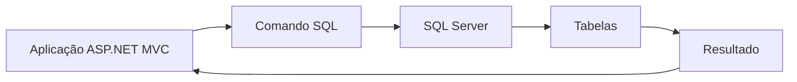
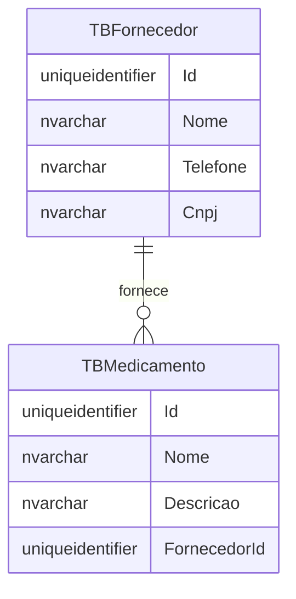

## SQL Server na Prática

Na aula anterior, vimos os conceitos básicos de SQL.

Vimos que um banco de dados relacional organiza informações em tabelas.

Também vimos comandos como:

- `SELECT`;
- `INSERT`;
- `UPDATE`;
- `DELETE`;
- `JOIN`.

Agora vamos dar um passo a mais.

Vamos olhar para o SQL pensando em uma aplicação ASP.NET MVC real.

O exemplo usado nesta aula é o sistema **Controle de Medicamentos**.

Nesse sistema, temos dados como:

- fornecedores;
- medicamentos;
- pacientes;
- funcionários;
- requisições de entrada;
- requisições de saída.

Essas informações precisam ficar guardadas em um banco SQL Server.

## O papel do SQL Server

O SQL Server é o sistema de banco de dados.

Ele é responsável por:

- criar tabelas;
- guardar registros;
- validar relacionamentos;
- executar consultas;
- devolver os resultados para a aplicação.

Quando a aplicação precisa listar medicamentos, ela não procura esses dados em uma lista na memória.

Ela envia um comando SQL para o SQL Server.

O SQL Server executa esse comando e devolve as linhas encontradas.



## Criando uma tabela

Uma tabela define o formato dos dados que serão armazenados.

No sistema de medicamentos, existe uma tabela para medicamentos.

Ela pode ser representada assim:

```sql
CREATE TABLE [dbo].[TBMedicamento] (
    [Id] UNIQUEIDENTIFIER NOT NULL,
    [Nome] NVARCHAR(100) NOT NULL,
    [Descricao] NVARCHAR(255) NOT NULL,
    [FornecedorId] UNIQUEIDENTIFIER NOT NULL,
    PRIMARY KEY CLUSTERED ([Id] ASC)
);
```

Esse script cria a tabela `TBMedicamento`.

Cada coluna tem um tipo.

Observe alguns exemplos:

- `UNIQUEIDENTIFIER` guarda um identificador único, como um `Guid` do C#;
- `NVARCHAR(100)` guarda texto com até 100 caracteres;
- `NOT NULL` indica que o campo é obrigatório.

## Comparando com uma classe C#

No C#, um medicamento poderia ter propriedades como:

```csharp
public class Medicamento
{
    public Guid Id { get; set; }
    public string Nome { get; set; }
    public string Descricao { get; set; }
    public Fornecedor Fornecedor { get; set; }
}
```

No banco, a tabela não guarda o objeto `Fornecedor` inteiro.

Ela guarda apenas o identificador do fornecedor:

```sql
[FornecedorId] UNIQUEIDENTIFIER NOT NULL
```

Isso acontece porque o fornecedor está em outra tabela.

Então o medicamento aponta para o fornecedor usando uma chave estrangeira.

## Chave primária

A chave primária identifica uma linha da tabela.

Na tabela `TBMedicamento`, a chave primária é a coluna `Id`.

```sql
PRIMARY KEY CLUSTERED ([Id] ASC)
```

Isso significa:

> cada medicamento precisa ter um `Id` único.

Esse identificador permite que a aplicação encontre, edite ou exclua um medicamento específico.

Por exemplo:

```sql
SELECT [Id], [Nome], [Descricao], [FornecedorId]
FROM [dbo].[TBMedicamento]
WHERE [Id] = @Id;
```

O `WHERE` usa o `Id` para buscar apenas uma linha.

## Chave estrangeira

A chave estrangeira representa um relacionamento entre tabelas.

No sistema, cada medicamento pertence a um fornecedor.

Por isso, a tabela `TBMedicamento` possui a coluna `FornecedorId`.

Depois, o banco cria uma restrição:

```sql
ALTER TABLE [dbo].[TBMedicamento]
ADD CONSTRAINT [FK_TBMedicamento_TBFornecedor]
FOREIGN KEY ([FornecedorId])
REFERENCES [dbo].[TBFornecedor] ([Id]);
```

Esse comando diz:

> o valor de `FornecedorId` precisa existir na tabela `TBFornecedor`.

Isso protege o banco.

Sem essa regra, poderíamos cadastrar um medicamento apontando para um fornecedor que não existe.

## Relacionamento entre tabelas

O relacionamento entre fornecedor e medicamento pode ser visualizado assim:



Esse diagrama mostra que:

- um fornecedor pode fornecer vários medicamentos;
- cada medicamento possui um fornecedor;
- a ligação acontece pela coluna `FornecedorId`.

## Inserindo dados

Para cadastrar um medicamento, usamos `INSERT`.

```sql
INSERT INTO [dbo].[TBMedicamento] ([Id], [Nome], [Descricao], [FornecedorId])
VALUES (@Id, @Nome, @Descricao, @FornecedorId);
```

Repare nos valores iniciados com `@`.

Eles são parâmetros.

Em vez de escrever os valores diretamente no SQL, a aplicação envia os valores separados.

Isso é importante porque:

- evita misturar texto do usuário com o comando SQL;
- ajuda a proteger contra SQL Injection;
- facilita reutilizar o mesmo comando com valores diferentes.

## Atualizando dados

Para alterar um medicamento, usamos `UPDATE`.

```sql
UPDATE [dbo].[TBMedicamento]
SET
    [Nome] = @Nome,
    [Descricao] = @Descricao,
    [FornecedorId] = @FornecedorId
WHERE [Id] = @Id;
```

O `SET` indica quais colunas serão alteradas.

O `WHERE` indica qual registro será alterado.

> **Atenção:** em comandos `UPDATE`, o `WHERE` é essencial.

Sem `WHERE`, o SQL Server pode alterar todos os registros da tabela.

## Excluindo dados

Para excluir um medicamento, usamos `DELETE`.

```sql
DELETE FROM [dbo].[TBMedicamento]
WHERE [Id] = @Id;
```

Novamente, o `WHERE` define qual linha será removida.

Em sistemas reais, exclusões podem falhar quando existem relacionamentos.

Por exemplo, se um medicamento já aparece em uma requisição, o banco pode impedir a exclusão para preservar a integridade dos dados.

## Buscando dados relacionados

Quando listamos medicamentos na tela, geralmente não queremos mostrar apenas o `FornecedorId`.

Queremos mostrar também o nome do fornecedor.

Para isso, usamos `JOIN`.

```sql
SELECT
    m.[Id],
    m.[Nome],
    m.[Descricao],
    f.[Nome] AS [Fornecedor]
FROM [dbo].[TBMedicamento] AS m
JOIN [dbo].[TBFornecedor] AS f
    ON f.[Id] = m.[FornecedorId]
ORDER BY m.[Nome];
```

Esse comando busca dados em duas tabelas:

- `TBMedicamento`;
- `TBFornecedor`.

O `JOIN` conecta as duas tabelas pela chave:

```sql
ON f.[Id] = m.[FornecedorId]
```

Em linguagem simples:

> traga o medicamento junto com o fornecedor ao qual ele pertence.

## Scripts de banco

Em projetos ASP.NET MVC, é comum separar os scripts SQL em arquivos próprios.

Esses arquivos ajudam a registrar a estrutura do banco.

Um script pode criar:

- tabelas;
- chaves primárias;
- chaves estrangeiras;
- índices;
- dados iniciais.

Isso permite que outra pessoa recrie o banco com mais facilidade.

Também ajuda a entender quais tabelas fazem parte do sistema.

## O que a aplicação precisa saber

A aplicação C# não precisa saber todos os detalhes internos do SQL Server.

Mas ela precisa saber o suficiente para:

- abrir conexão com o banco;
- enviar comandos SQL;
- passar parâmetros;
- ler resultados;
- transformar linhas em objetos.

Essa ponte entre C# e SQL Server será feita com Dapper.

## Resumo prático

Nesta aula, vimos que:

- o SQL Server guarda os dados da aplicação;
- uma tabela define quais colunas existem;
- `UNIQUEIDENTIFIER` combina bem com `Guid`;
- `NVARCHAR` guarda textos;
- chave primária identifica um registro;
- chave estrangeira liga uma tabela a outra;
- `JOIN` busca dados relacionados;
- parâmetros com `@` recebem valores enviados pela aplicação.

## Fechamento

O SQL Server não é apenas um lugar onde os dados ficam guardados.

Ele também protege a organização dos dados.

Quando usamos chaves primárias, chaves estrangeiras e tipos corretos, criamos uma base mais confiável para a aplicação.

Na próxima aula, veremos como o C# conversa com esse banco usando Dapper.
