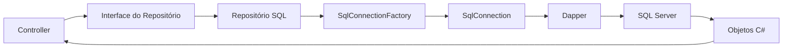

## Integração com Dapper

Na aula anterior, vimos como o SQL Server organiza os dados.

Agora surge uma nova pergunta:

> como a aplicação ASP.NET MVC envia comandos SQL para o banco?

Para isso, podemos usar uma biblioteca chamada **Dapper**.

O Dapper ajuda o C# a executar SQL e transformar resultados em objetos.

Ele não substitui o SQL.

Na verdade, ele trabalha junto com o SQL.

## O problema que o Dapper resolve

Sem uma biblioteca de apoio, conversar com o banco exige bastante código manual.

A aplicação precisaria:

- abrir uma conexão;
- criar um comando;
- configurar parâmetros;
- executar o comando;
- ler cada coluna do resultado;
- montar os objetos manualmente.

O Dapper simplifica essa parte.

Com ele, conseguimos escrever o SQL e pedir para a biblioteca executar.

Depois, o Dapper tenta preencher os objetos C# com os dados retornados.

## O pacote do Dapper

Em uma aplicação ASP.NET MVC, o Dapper normalmente é instalado como pacote NuGet.

Também usamos o pacote do SQL Server:

```bash
dotnet add package Dapper
dotnet add package Microsoft.Data.SqlClient
```

O `Dapper` fornece métodos como:

- `Execute`;
- `Query`;
- `QuerySingleOrDefault`.

O `Microsoft.Data.SqlClient` fornece a classe `SqlConnection`.

Ela representa a conexão com o SQL Server.

## Connection string

Antes de abrir uma conexão, a aplicação precisa saber onde o banco está.

Essa informação fica na **connection string**.

Uma connection string é um texto com os dados de conexão.

Exemplo:

```json
{
  "ConnectionStrings": {
    "ControleDeMedicamentosWeb": "Server=(localdb)\\MSSQLLocalDB;Database=ControleDeMedicamentosWeb;Trusted_Connection=True;"
  }
}
```

Esse valor costuma ficar no `appsettings.json` ou no `appsettings.Development.json`.

Assim, o endereço do banco fica na configuração, não espalhado pelo código.

## Criando uma fábrica de conexão

No projeto de exemplo, existe uma classe responsável por criar conexões.

Ela pode ser simplificada assim:

```csharp
public interface ISqlConnectionFactory
{
    SqlConnection CreateConnection();
}
```

Essa interface diz:

> existe um objeto capaz de criar uma conexão com o SQL Server.

A implementação lê a connection string da configuração:

```csharp
public sealed class SqlConnectionFactory(IConfiguration configuration) : ISqlConnectionFactory
{
    private const string NomeConnectionString = "ControleDeMedicamentosWeb";

    public SqlConnection CreateConnection()
    {
        string? connectionString = configuration.GetConnectionString(NomeConnectionString);

        if (string.IsNullOrWhiteSpace(connectionString))
            throw new InvalidOperationException("A connection string não foi encontrada.");

        return new SqlConnection(connectionString);
    }
}
```

Repare na responsabilidade dessa classe.

Ela não cadastra medicamento.

Ela não lista fornecedor.

Ela apenas cria conexões.

## Registrando a infraestrutura

Para o ASP.NET conseguir entregar essa fábrica aos repositórios, registramos a dependência.

Exemplo:

```csharp
services.AddScoped<ISqlConnectionFactory, SqlConnectionFactory>();
```

Depois, registramos os repositórios SQL:

```csharp
services.AddScoped<IRepositorioFornecedor, RepositorioFornecedorEmSql>();
services.AddScoped<IRepositorioMedicamento, RepositorioMedicamentoEmSql>();
services.AddScoped<IRepositorioPaciente, RepositorioPacienteEmSql>();
```

Esse registro conversa com o que já vimos em Injeção de Dependência.

O Controller depende de uma interface.

O ASP.NET entrega a implementação configurada.

## Fluxo completo

O fluxo de uma listagem com Dapper fica assim:



Esse fluxo mantém as responsabilidades separadas:

- o Controller coordena a requisição;
- o repositório conhece o SQL;
- a fábrica cria conexões;
- o Dapper executa comandos;
- o SQL Server guarda os dados.

## Executando comandos com `Execute`

O método `Execute` é usado para comandos que não retornam uma lista de objetos.

Ele é comum em:

- `INSERT`;
- `UPDATE`;
- `DELETE`.

Exemplo de cadastro de fornecedor:

```csharp
private const string InserirSql = """
    INSERT INTO dbo.TBFornecedor (Id, Nome, Telefone, Cnpj)
    VALUES (@Id, @Nome, @Telefone, @Cnpj);
""";

public void Cadastrar(Fornecedor fornecedor)
{
    using SqlConnection conexao = connectionFactory.CreateConnection();

    conexao.Open();

    conexao.Execute(InserirSql, fornecedor);
}
```

Observe três pontos importantes.

Primeiro, o repositório cria a conexão:

```csharp
using SqlConnection conexao = connectionFactory.CreateConnection();
```

Segundo, a conexão é aberta:

```csharp
conexao.Open();
```

Terceiro, o Dapper executa o SQL:

```csharp
conexao.Execute(InserirSql, fornecedor);
```

## Como os parâmetros são preenchidos

No SQL, os parâmetros aparecem com `@`:

```sql
VALUES (@Id, @Nome, @Telefone, @Cnpj);
```

No C#, o objeto `Fornecedor` possui propriedades com esses nomes.

Então o Dapper faz a associação:

| Parâmetro SQL | Propriedade C#        |
| ------------- | --------------------- |
| `@Id`         | `fornecedor.Id`       |
| `@Nome`       | `fornecedor.Nome`     |
| `@Telefone`   | `fornecedor.Telefone` |
| `@Cnpj`       | `fornecedor.Cnpj`     |

Isso deixa o código mais simples.

Mas os nomes precisam combinar.

Se o SQL espera `@Nome`, o objeto enviado precisa ter uma propriedade chamada `Nome`.

## Atualizando dados

Para editar, também usamos `Execute`.

```csharp
private const string AtualizarSql = """
    UPDATE dbo.TBFornecedor
    SET
        Nome = @Nome,
        Telefone = @Telefone,
        Cnpj = @Cnpj
    WHERE Id = @Id;
""";

public bool Editar(Guid idSelecionado, Fornecedor fornecedor)
{
    fornecedor.Id = idSelecionado;

    using SqlConnection conexao = connectionFactory.CreateConnection();

    conexao.Open();

    return conexao.Execute(AtualizarSql, fornecedor) == 1;
}
```

O `Execute` retorna quantas linhas foram afetadas.

Por isso, o código compara com `1`.

Se uma linha foi alterada, a edição funcionou.

## Excluindo dados

Para excluir, não precisamos enviar um objeto inteiro.

Podemos enviar apenas o `Id`.

```csharp
private const string ExcluirSql = """
    DELETE FROM dbo.TBFornecedor
    WHERE Id = @Id;
""";

public bool Excluir(Guid idSelecionado)
{
    using SqlConnection conexao = connectionFactory.CreateConnection();

    conexao.Open();

    return conexao.Execute(ExcluirSql, new { Id = idSelecionado }) == 1;
}
```

Aqui aparece um objeto anônimo:

```csharp
new { Id = idSelecionado }
```

Esse objeto possui uma propriedade chamada `Id`.

Ela será usada para preencher o parâmetro `@Id`.

## Buscando uma lista com `Query`

Quando o SQL retorna várias linhas, usamos `Query`.

Exemplo:

```csharp
private const string SelecionarTodosSql = """
    SELECT Id, Nome, Telefone, Cnpj
    FROM dbo.TBFornecedor
    ORDER BY Nome;
""";

public List<Fornecedor> SelecionarTodos()
{
    using SqlConnection conexao = connectionFactory.CreateConnection();

    conexao.Open();

    return conexao.Query<Fornecedor>(SelecionarTodosSql).ToList();
}
```

O trecho principal é:

```csharp
conexao.Query<Fornecedor>(SelecionarTodosSql)
```

Isso significa:

> execute o SQL e tente transformar cada linha em um objeto `Fornecedor`.

Para isso funcionar bem, as colunas retornadas precisam combinar com as propriedades da classe.

## Buscando um registro com `QuerySingleOrDefault`

Quando queremos buscar um único registro, usamos `QuerySingleOrDefault`.

```csharp
private const string SelecionarPorIdSql = """
    SELECT Id, Nome, Telefone, Cnpj
    FROM dbo.TBFornecedor
    WHERE Id = @Id;
""";

public Fornecedor? SelecionarPorId(Guid idSelecionado)
{
    using SqlConnection conexao = connectionFactory.CreateConnection();

    conexao.Open();

    return conexao.QuerySingleOrDefault<Fornecedor>(
        SelecionarPorIdSql,
        new { Id = idSelecionado }
    );
}
```

Esse método pode retornar:

- um fornecedor, se encontrar;
- `null`, se não encontrar.

Por isso, o retorno é `Fornecedor?`.

## Quando o resultado não combina direto

Às vezes, o SQL retorna dados de mais de uma tabela.

Por exemplo, ao listar medicamentos, queremos trazer dados do medicamento e do fornecedor.

O SQL pode retornar colunas com apelidos:

```sql
SELECT
    m.Id AS MedicamentoId,
    m.Nome AS MedicamentoNome,
    f.Id AS FornecedorId,
    f.Nome AS FornecedorNome
FROM dbo.TBMedicamento AS m
JOIN dbo.TBFornecedor AS f
    ON f.Id = m.FornecedorId;
```

Nesse caso, o resultado não encaixa diretamente em `Medicamento`.

Por isso, podemos criar uma classe auxiliar para representar a linha do banco:

```csharp
public sealed class MedicamentoRow
{
    public Guid MedicamentoId { get; set; }
    public string MedicamentoNome { get; set; } = string.Empty;
    public Guid FornecedorId { get; set; }
    public string FornecedorNome { get; set; } = string.Empty;
}
```

Essa classe não é uma entidade do domínio.

Ela é apenas um formato intermediário para ler o resultado do SQL.

Depois, o repositório transforma essa linha em objeto de domínio:

```csharp
private static Medicamento MapearMedicamento(MedicamentoRow linha)
{
    return new Medicamento
    {
        Id = linha.MedicamentoId,
        Nome = linha.MedicamentoNome,
        Fornecedor = new Fornecedor
        {
            Id = linha.FornecedorId,
            Nome = linha.FornecedorNome
        }
    };
}
```

Esse processo é chamado de mapeamento.

## Transações

Algumas operações precisam gravar dados em mais de uma tabela.

Uma requisição de saída, por exemplo, pode envolver:

- um registro em `TBRequisicao`;
- um registro em `TBRequisicaoSaida`;
- vários registros em `TBMedicamentoPrescrito`.

Essas gravações precisam funcionar como uma única operação.

Se uma parte falhar, o ideal é desfazer tudo.

Para isso usamos uma transação.

```csharp
using SqlTransaction transacao = conexao.BeginTransaction();

try
{
    conexao.Execute(InserirRequisicaoSql, requisicao, transacao);
    conexao.Execute(InserirRequisicaoSaidaSql, parametros, transacao);

    transacao.Commit();
}
catch
{
    transacao.Rollback();
    throw;
}
```

Em linguagem simples:

> ou todas as gravações são confirmadas, ou nenhuma delas fica salva.

## Um cuidado com tipos

O banco SQL Server usa tipos próprios.

O C# também usa tipos próprios.

Normalmente, o Dapper consegue converter os valores automaticamente.

Mas alguns tipos exigem cuidado.

Por exemplo, se o banco espera `int`, o valor enviado pela aplicação também deve ser compatível.

No projeto de exemplo, uma quantidade pode ser convertida antes de ser enviada:

```csharp
Quantidade = (int)requisicaoEntrada.Quantidade
```

Isso evita que a aplicação envie um tipo que o SQL Server não sabe interpretar naquele parâmetro.

## O que fica em cada camada

Com Dapper, é importante manter a separação:

- o Controller não deve escrever SQL;
- a Service não deve abrir conexão diretamente;
- o repositório deve concentrar o acesso ao banco;
- a fábrica de conexão deve criar conexões;
- as entidades devem representar o domínio.

Assim, a aplicação continua organizada.

Mesmo trocando o armazenamento de arquivo JSON para SQL Server, o restante do sistema pode continuar dependendo das interfaces.

## Resumo prático

Nesta aula, vimos que:

- Dapper conecta o C# aos comandos SQL;
- `SqlConnection` representa a conexão com SQL Server;
- a connection string fica na configuração;
- `ISqlConnectionFactory` centraliza a criação de conexões;
- `Execute` executa `INSERT`, `UPDATE` e `DELETE`;
- `Query` busca várias linhas;
- `QuerySingleOrDefault` busca um registro ou retorna `null`;
- parâmetros com `@` são preenchidos por objetos C#;
- classes auxiliares podem ajudar no mapeamento de `JOIN`;
- transações protegem operações que gravam em várias tabelas.

## Fechamento

O Dapper é uma ponte entre a aplicação e o banco.

Ele permite continuar escrevendo SQL de forma explícita, mas reduz o trabalho repetitivo de executar comandos e transformar resultados em objetos.

Com isso, o repositório passa a ser o lugar onde a aplicação conversa com o SQL Server.

O Controller continua focado no fluxo da requisição.

A Service continua focada nas regras.

E o banco continua responsável por guardar os dados com segurança.
