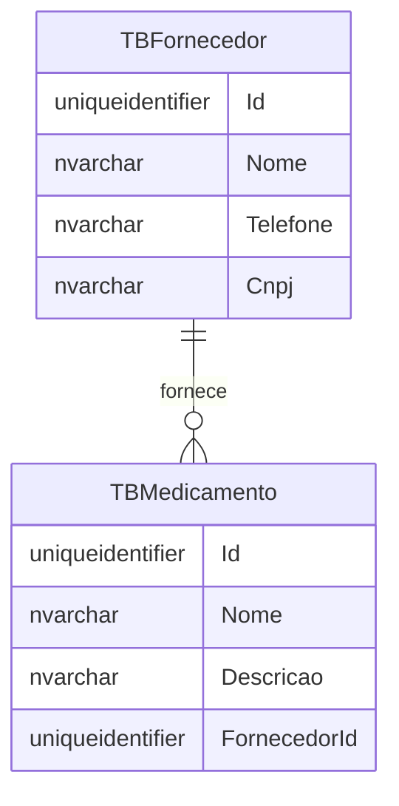

## SQL Server Database Projects

Até agora, vimos que uma aplicação ASP.NET MVC pode usar SQL Server para persistir dados.

Também vimos que o banco possui tabelas, colunas, chaves primárias e chaves estrangeiras.

Mas surge uma pergunta importante:

> onde guardamos a estrutura do banco dentro do projeto?

Uma opção ruim seria deixar os scripts soltos no computador de cada pessoa.

Outra opção ruim seria criar o banco manualmente, clicando em telas do SQL Server Management Studio.

Essas opções funcionam no começo.

Mas ficam difíceis de manter quando o projeto cresce.

Para resolver isso, podemos usar um **SQL Server Database Project**.

## O que é um Database Project?

Um Database Project é um projeto que representa a estrutura do banco de dados.

Ele guarda scripts SQL dentro do repositório.

Esses scripts descrevem objetos como:

- tabelas;
- colunas;
- chaves primárias;
- chaves estrangeiras;
- relacionamentos;
- índices;
- procedures, quando existirem.

Em vez de o banco existir apenas dentro do SQL Server, a estrutura dele também passa a existir no código-fonte.

Isso ajuda a equipe a versionar o banco junto com a aplicação.

## O banco como parte da solução

No exemplo do Controle de Medicamentos, existe um projeto chamado:

```text
ControleDeMedicamentosWeb.Database
```

Dentro dele, existe um arquivo:

```text
ControleDeMedicamentosWeb.Database.sqlproj
```

Esse arquivo identifica o projeto de banco.

Uma versão simplificada dele é:

```xml
<Project DefaultTargets="Build">
  <Sdk Name="Microsoft.Build.Sql" Version="2.1.0" />

  <PropertyGroup>
    <Name>ControleDeMedicamentosWeb.Database</Name>
    <DSP>Microsoft.Data.Tools.Schema.Sql.Sql170DatabaseSchemaProvider</DSP>
  </PropertyGroup>
</Project>
```

O ponto principal está nesta linha:

```xml
<Sdk Name="Microsoft.Build.Sql" Version="2.1.0" />
```

Ela indica que esse projeto usa o SDK de build para projetos SQL.

Assim, podemos compilar o projeto de banco com o `dotnet build`.

## O que significa compilar um banco?

Quando compilamos uma aplicação C#, o compilador verifica se o código faz sentido.

Com um Database Project, acontece algo parecido.

O build verifica se os scripts SQL formam um modelo de banco válido.

Por exemplo:

- uma tabela referenciada precisa existir;
- uma coluna usada em uma chave estrangeira precisa existir;
- os tipos precisam estar bem definidos;
- os scripts precisam estar corretos.

Isso ajuda a encontrar problemas antes de publicar o banco em um ambiente real.

## Organização dos scripts

No projeto de banco, os scripts ficam organizados por pasta.

Um exemplo comum é:

```text
ControleDeMedicamentosWeb.Database/
  dbo/
    Tables/
      TBFornecedor.sql
      TBMedicamento.sql
```

Essa organização mostra que os arquivos pertencem ao schema `dbo`.

Dentro de `Tables`, ficam os scripts das tabelas.

## Exemplo de tabela

A tabela de fornecedores pode ser descrita assim:

```sql
CREATE TABLE [dbo].[TBFornecedor] (
    [Id]       UNIQUEIDENTIFIER NOT NULL,
    [Nome]     NVARCHAR (100)   NOT NULL,
    [Telefone] NVARCHAR (15)    NOT NULL,
    [Cnpj]     NVARCHAR (18)    NOT NULL,
    PRIMARY KEY CLUSTERED ([Id] ASC)
);
GO
```

Esse script não é apenas um comando para executar uma vez.

Dentro do Database Project, ele representa o estado esperado dessa tabela.

Em outras palavras:

> o projeto declara como a tabela `TBFornecedor` deve ser.

## Exemplo com relacionamento

A tabela de medicamentos depende da tabela de fornecedores.

Ela possui a coluna `FornecedorId`:

```sql
CREATE TABLE [dbo].[TBMedicamento] (
    [Id]           UNIQUEIDENTIFIER NOT NULL,
    [Nome]         NVARCHAR (100)   NOT NULL,
    [Descricao]    NVARCHAR (255)   NOT NULL,
    [FornecedorId] UNIQUEIDENTIFIER NOT NULL,
    PRIMARY KEY CLUSTERED ([Id] ASC)
);
GO
```

Depois, o relacionamento é declarado com uma chave estrangeira:

```sql
ALTER TABLE [dbo].[TBMedicamento]
    ADD CONSTRAINT [FK_TBMedicamento_TBFornecedor]
    FOREIGN KEY ([FornecedorId])
    REFERENCES [dbo].[TBFornecedor] ([Id]);
GO
```

Isso significa:

> um medicamento só pode apontar para um fornecedor existente.

## Visualizando o relacionamento



Esse relacionamento também é validado pelo projeto de banco.

Se a tabela `TBFornecedor` não existisse, o build poderia falhar.

## Build do Database Project

Como o projeto usa `Microsoft.Build.Sql`, podemos executar:

```bash
dotnet build ControleDeMedicamentosWeb.Database/ControleDeMedicamentosWeb.Database.sqlproj
```

Esse comando compila o projeto de banco.

Se tudo estiver correto, ele gera um artefato chamado **DACPAC**.

## O que é um DACPAC?

Um DACPAC é um pacote que representa o modelo do banco.

Ele contém a estrutura esperada do banco de dados.

Esse pacote pode ser usado para publicar alterações em um SQL Server.

Pense nele como:

> o resultado compilado do projeto de banco.

Na prática:

- o `.sqlproj` é o projeto;
- os `.sql` são os scripts;
- o `.dacpac` é o pacote gerado pelo build.

## Fluxo do Database Project


Esse fluxo permite que a estrutura do banco acompanhe a aplicação.

Quando o projeto evolui, os scripts também evoluem.

## Benefícios

Usar um SQL Server Database Project ajuda a:

- versionar a estrutura do banco;
- revisar alterações de banco junto com o código;
- validar scripts durante o build;
- gerar um pacote de publicação;
- automatizar deploy do banco;
- reduzir mudanças manuais em produção.

Isso aproxima o banco do mesmo fluxo usado para a aplicação.

## Cuidado importante

Um Database Project descreve a estrutura esperada do banco.

Mas publicar alterações em um banco real exige cuidado.

Algumas mudanças podem afetar dados existentes.

Por exemplo:

- remover uma coluna;
- alterar o tipo de uma coluna;
- tornar um campo obrigatório;
- excluir uma tabela.

Por isso, ambientes reais costumam validar essas mudanças antes da publicação.

## Resumo prático

Nesta aula, vimos que:

- um Database Project guarda a estrutura do banco no repositório;
- o arquivo `.sqlproj` identifica o projeto de banco;
- os arquivos `.sql` descrevem tabelas e relacionamentos;
- `Microsoft.Build.Sql` permite compilar o projeto;
- o build gera um arquivo `.dacpac`;
- o DACPAC pode ser usado para publicar o schema no SQL Server.

## Fechamento

O SQL Server Database Project transforma o banco em parte do projeto.

Isso facilita o versionamento, a revisão e a automação.

Em vez de tratar o banco como algo separado da aplicação, passamos a tratá-lo como uma entrega que também pode ser compilada e publicada.
