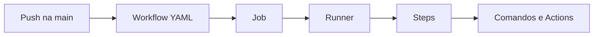

## Workflows YAML

Depois que uma aplicação está no GitHub, podemos automatizar tarefas do projeto.

Por exemplo:

- baixar o código;
- instalar o .NET;
- compilar a aplicação;
- executar testes;
- gerar arquivos de publicação;
- publicar a aplicação em um servidor.

No GitHub, essas automações são descritas em arquivos YAML.

Esses arquivos são chamados de **workflows**.

## O que é YAML?

YAML é um formato de texto usado para configurar informações.

Ele é muito usado em ferramentas de automação.

Um arquivo YAML costuma ter:

- nomes;
- listas;
- blocos;
- valores;
- indentação.

Exemplo simples:

```yaml
name: Exemplo de Workflow

on:
  push:
    branches:
      - main
```

Esse trecho pode ser lido assim:

> existe um workflow chamado `Exemplo de Workflow`, executado quando houver um `push` na branch `main`.

## A importância da indentação

Em YAML, a indentação faz parte da estrutura.

Isso significa que espaços no começo da linha importam.

Exemplo:

```yaml
on:
  push:
    branches:
      - main
```

Aqui, `push` está dentro de `on`.

E `branches` está dentro de `push`.

Se a indentação estiver errada, o GitHub pode não conseguir interpretar o arquivo.

## Onde ficam os workflows?

No GitHub Actions, os workflows ficam dentro da pasta:

```text
.github/workflows/
```

Cada arquivo `.yml` ou `.yaml` dentro dessa pasta pode representar uma automação.

Exemplo:

```text
.github/
  workflows/
    main_controle-de-medicamentos-web.yml
```

Esse arquivo descreve um fluxo de build e deploy.

## Estrutura principal de um workflow

Um workflow costuma ter algumas partes importantes:

```yaml
name: Build and deploy ASP.Net Core app

on:
  push:
    branches:
      - main
  workflow_dispatch:

jobs:
  build:
    runs-on: windows-latest
    steps:
      - uses: actions/checkout@v4
```

Vamos entender por partes.

## `name`

O `name` define o nome do workflow.

É esse nome que aparece na aba **Actions** do GitHub.

```yaml
name: Build and deploy ASP.Net Core app
```

Esse nome deve deixar claro o objetivo da automação.

## `on`

O `on` define quando o workflow será executado.

Exemplo:

```yaml
on:
  push:
    branches:
      - main
  workflow_dispatch:
```

Nesse caso, o workflow roda em duas situações:

- quando houver `push` na branch `main`;
- quando alguém executar manualmente pela interface do GitHub.

O `workflow_dispatch` habilita essa execução manual.

## `jobs`

O `jobs` define os trabalhos que serão executados.

Um workflow pode ter um ou vários jobs.

Exemplo:

```yaml
jobs:
  build:
    runs-on: windows-latest
```

Aqui existe um job chamado `build`.

Ele roda em uma máquina Windows fornecida pelo GitHub.

## `runs-on`

O `runs-on` define o ambiente onde o job será executado.

Exemplo:

```yaml
runs-on: windows-latest
```

Isso indica que o job usará um runner Windows.

Um **runner** é a máquina que executa os passos do workflow.

## `steps`

O `steps` define a sequência de passos dentro de um job.

Exemplo:

```yaml
steps:
  - uses: actions/checkout@v4

  - name: Set up .NET Core
    uses: actions/setup-dotnet@v4
    with:
      dotnet-version: "10.x"
```

Cada item da lista representa uma ação.

Alguns passos usam actions prontas.

Outros executam comandos diretamente.

## `uses`

O `uses` indica que o passo usa uma action pronta.

Exemplo:

```yaml
- uses: actions/checkout@v4
```

Essa action baixa o código do repositório para dentro do runner.

Sem isso, o runner não teria os arquivos do projeto para compilar.

Outro exemplo:

```yaml
- uses: actions/setup-dotnet@v4
```

Essa action instala ou configura o SDK do .NET.

## `run`

O `run` executa um comando no terminal do runner.

Exemplo:

```yaml
- name: Build with dotnet
  run: dotnet build --configuration Release
```

Esse passo executa o build da aplicação.

É parecido com rodar o comando manualmente no computador.

A diferença é que ele roda dentro do GitHub Actions.

## `with`

O `with` passa configurações para uma action.

Exemplo:

```yaml
- name: Set up .NET Core
  uses: actions/setup-dotnet@v4
  with:
    dotnet-version: "10.x"
```

Aqui estamos dizendo para a action configurar o .NET 10.

## Fluxo visual



Esse é o caminho básico de uma automação.

O evento dispara o workflow.

O workflow executa jobs.

Cada job roda em um runner.

Cada runner executa steps.

## Resumo prático

Nesta aula, vimos que:

- workflows são automações do GitHub Actions;
- workflows ficam em `.github/workflows`;
- YAML usa indentação para organizar dados;
- `name` define o nome da automação;
- `on` define quando ela roda;
- `jobs` define os trabalhos;
- `runs-on` escolhe o runner;
- `steps` define a sequência de ações;
- `uses` usa actions prontas;
- `run` executa comandos.

## Fechamento

Um arquivo YAML de workflow é como uma receita de automação.

Ele descreve quando a automação deve começar e quais passos devem ser executados.

Na próxima aula, veremos como essa estrutura aparece em um deploy real para Azure.
