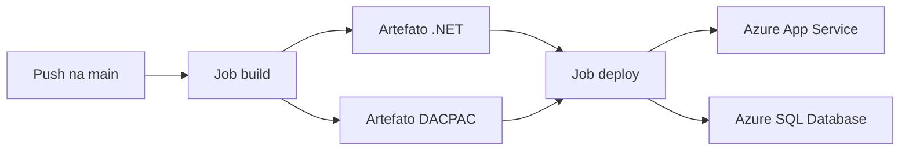
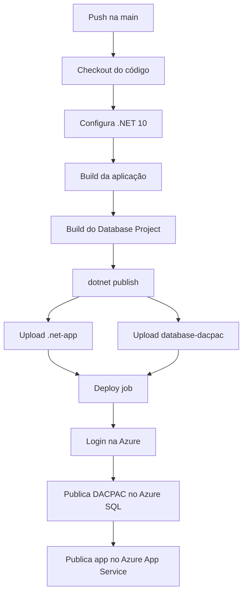

## GitHub Actions e Deploy na Azure

Na aula anterior, vimos a estrutura básica de um workflow YAML.

Agora vamos olhar para um uso prático:

> publicar uma aplicação ASP.NET Core na Azure usando GitHub Actions.

No exemplo do Controle de Medicamentos, o workflow faz duas entregas:

- publica a aplicação web no Azure App Service;
- publica o schema do banco no Azure SQL.

Isso é importante porque a aplicação e o banco precisam evoluir juntos.

## O que é GitHub Actions?

GitHub Actions é a ferramenta de automação do GitHub.

Com ela, podemos executar tarefas quando algo acontece no repositório.

Por exemplo:

- quando alguém envia código para a branch `main`;
- quando uma Pull Request é aberta;
- quando alguém executa manualmente um workflow;
- quando chega um horário agendado.

No deploy, o objetivo é automatizar a publicação.

Em vez de publicar manualmente pelo Visual Studio ou pelo portal da Azure, o GitHub executa os passos necessários.

## O que é deploy?

Deploy é o processo de enviar uma aplicação para um ambiente onde ela será executada.

No caso deste exemplo, o destino é a Azure.

A aplicação ASP.NET Core vai para um **Azure App Service**.

O schema do banco vai para um **Azure SQL Database**.

## Visão geral do workflow

O workflow pode ser dividido em duas partes principais:

- `build`;
- `deploy`.

O job `build` prepara os artefatos.

O job `deploy` publica esses artefatos na Azure.



## Quando o workflow executa

O workflow é configurado para rodar em `push` na branch `main`.

Também permite execução manual.

```yaml
on:
  push:
    branches:
      - main
  workflow_dispatch:
```

Isso significa:

- ao enviar alterações para `main`, o deploy pode iniciar;
- pelo `workflow_dispatch`, alguém pode rodar o workflow manualmente.

## Job de build

O primeiro job é o `build`.

```yaml
jobs:
  build:
    runs-on: windows-latest
```

Ele roda em um runner Windows.

Esse job prepara tudo que será necessário para a publicação.

## Baixando o código

O primeiro passo usa `actions/checkout`.

```yaml
- uses: actions/checkout@v4
```

Esse passo baixa o código do repositório para o runner.

Sem isso, os próximos comandos não teriam acesso aos arquivos da aplicação.

## Configurando o .NET

Depois, o workflow configura o SDK do .NET.

```yaml
- name: Set up .NET Core
  uses: actions/setup-dotnet@v4
  with:
    dotnet-version: "10.x"
```

Esse passo prepara o runner para compilar um projeto em .NET 10.

## Compilando a aplicação

O build da aplicação é feito com:

```yaml
- name: Build with dotnet
  run: dotnet build --configuration Release
```

Esse comando verifica se a aplicação compila em modo `Release`.

O modo `Release` é usado para publicação.

## Compilando o projeto de banco

O workflow também compila o Database Project.

```yaml
- name: Build database project
  run: dotnet build ControleDeMedicamentosWeb.Database/ControleDeMedicamentosWeb.Database.sqlproj --configuration Release
```

Esse passo gera o DACPAC do banco.

O DACPAC será usado depois para publicar o schema no Azure SQL.

## Publicando a aplicação em uma pasta

Antes de enviar a aplicação para a Azure, o workflow executa `dotnet publish`.

```yaml
- name: dotnet publish
  run: dotnet publish -c Release -o "${{env.DOTNET_ROOT}}/myapp"
```

Esse comando gera os arquivos prontos para publicação.

Eles ficam em uma pasta temporária do runner.

## Artefatos

Um artefato é um arquivo ou pasta produzido por um job e guardado pelo GitHub Actions.

No workflow, existem dois artefatos importantes:

- `.net-app`;
- `database-dacpac`.

O primeiro guarda a aplicação publicada.

O segundo guarda o pacote do banco.

## Upload do artefato da aplicação

```yaml
- name: Upload artifact for deployment job
  uses: actions/upload-artifact@v4
  with:
    name: .net-app
    path: ${{env.DOTNET_ROOT}}/myapp
```

Esse passo envia a aplicação publicada para o GitHub Actions.

Assim, outro job pode baixar esse resultado.

## Upload do artefato do banco

```yaml
- name: Upload database artifact for deployment job
  uses: actions/upload-artifact@v4
  with:
    name: database-dacpac
    path: ControleDeMedicamentosWeb.Database/bin/Release/ControleDeMedicamentosWeb.Database.dacpac
```

Esse passo envia o DACPAC gerado pelo Database Project.

Agora o job de deploy poderá usar esse pacote.

## Job de deploy

O job `deploy` depende do job `build`.

```yaml
deploy:
  runs-on: windows-latest
  needs: build
```

O `needs: build` indica:

> execute o deploy somente depois que o build terminar com sucesso.

Isso evita publicar uma aplicação que não compilou corretamente.

## Permissões do deploy

O job de deploy possui permissões específicas:

```yaml
permissions:
  id-token: write
  contents: read
```

O `contents: read` permite ler informações do repositório.

O `id-token: write` permite solicitar um token de identidade para autenticação com a Azure.

Esse tipo de autenticação evita guardar usuário e senha no workflow.

## Baixando os artefatos

O deploy baixa os artefatos gerados no job anterior.

```yaml
- name: Download artifact from build job
  uses: actions/download-artifact@v4
  with:
    name: .net-app
```

E também baixa o DACPAC:

```yaml
- name: Download database artifact from build job
  uses: actions/download-artifact@v4
  with:
    name: database-dacpac
    path: database
```

Depois disso, o runner tem acesso aos arquivos necessários para publicar.

## Login na Azure

Antes de publicar, o workflow precisa autenticar na Azure.

```yaml
- name: Login to Azure
  uses: azure/login@v2
  with:
    client-id: ${{ secrets.AZUREAPPSERVICE_CLIENTID_ACC27C8186A9449C973E2066F378C61C }}
    tenant-id: ${{ secrets.AZUREAPPSERVICE_TENANTID_C92E88B920CC48B292B1E5570CDBDBCF }}
    subscription-id: ${{ secrets.AZUREAPPSERVICE_SUBSCRIPTIONID_8BADE6A77B9644888D69C434F2D47681 }}
```

Esses valores vêm de `secrets`.

Secrets são variáveis sensíveis guardadas no GitHub.

Eles servem para não escrever credenciais diretamente no arquivo YAML.

## Deploy do banco

Depois do login, o workflow publica o schema no Azure SQL.

```yaml
- name: Deploy database schema
  uses: azure/sql-action@v2.3
  with:
    connection-string: ${{ secrets.AZURE_SQL_CONNECTION_STRING }}
    path: database/ControleDeMedicamentosWeb.Database.dacpac
    action: Publish
    arguments: /p:BlockOnPossibleDataLoss=true
```

Esse passo usa o DACPAC gerado no build.

O `action: Publish` indica que o schema será publicado no banco.

O argumento `BlockOnPossibleDataLoss=true` é uma proteção.

Ele bloqueia alterações que possam causar perda de dados.

## Deploy da aplicação web

Por fim, o workflow publica a aplicação no Azure App Service.

```yaml
- name: Deploy to Azure Web App
  uses: azure/webapps-deploy@v3
  with:
    app-name: "controle-de-medicamentos-web"
    slot-name: "Production"
    package: .
```

Esse passo envia a aplicação para o App Service chamado `controle-de-medicamentos-web`.

O `slot-name: "Production"` indica o slot de produção.

## Por que separar build e deploy?

Separar `build` e `deploy` deixa o fluxo mais claro.

O build responde:

> o projeto compila e gera os artefatos necessários?

O deploy responde:

> os artefatos podem ser publicados na Azure?

Essa separação ajuda a identificar onde o problema aconteceu.

Se o build falhar, o problema está antes da publicação.

Se o deploy falhar, o problema está na autenticação, nos secrets, na Azure ou na publicação dos artefatos.

## Fluxo completo



## Resumo prático

Nesta aula, vimos que:

- GitHub Actions automatiza tarefas do repositório;
- o workflow roda em `push` na `main` ou manualmente;
- o job `build` compila aplicação e banco;
- o Database Project gera um DACPAC;
- artefatos passam arquivos do build para o deploy;
- `azure/login` autentica o workflow na Azure;
- `azure/sql-action` publica o schema no Azure SQL;
- `azure/webapps-deploy` publica a aplicação no App Service;
- secrets guardam valores sensíveis;
- `needs: build` impede deploy sem build bem-sucedido.

## Fechamento

Com GitHub Actions, o deploy deixa de depender de uma sequência manual no computador do desenvolvedor.

O repositório passa a ter uma receita clara de publicação.

Quando a aplicação e o banco são compilados juntos, o processo fica mais previsível.

E quando o deploy é automatizado, a equipe consegue publicar com mais segurança e repetibilidade.
