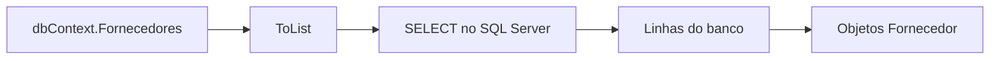
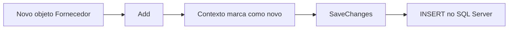
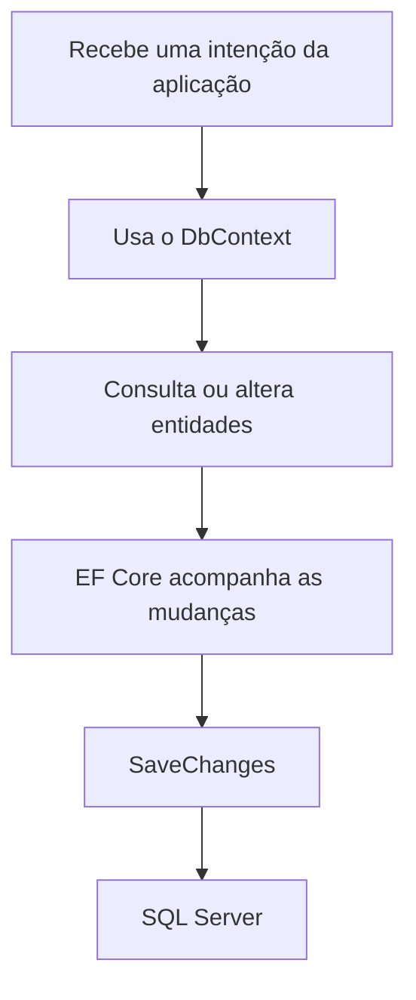
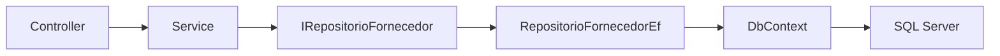

## Consultas e Comandos com DbContext

Na aula anterior, vimos a entrada do Entity Framework Core.

Vimos que o `DbContext` representa a comunicação da aplicação com o banco.

Também vimos que o `DbSet` representa uma coleção de entidades.

Agora vamos dar o próximo passo:

> usar o `DbContext` para consultar, cadastrar, editar e excluir dados.

Nesta aula, o foco será entender o fluxo.

Primeiro, vamos usar o `DbContext` diretamente.

Depois, vamos embrulhar esse uso dentro de um repositório.

## O DbContext como porta de entrada

O `DbContext` é a porta de entrada do Entity Framework.

Ele conhece:

- a connection string;
- as entidades;
- as configurações das entidades;
- as mudanças que aconteceram nos objetos;
- o momento de enviar comandos para o banco.

Um contexto pode ter esta aparência:

```csharp
using Microsoft.EntityFrameworkCore;

public class ControleDeMedicamentosDbContext : DbContext
{
    public ControleDeMedicamentosDbContext(DbContextOptions<ControleDeMedicamentosDbContext> options)
        : base(options)
    {
    }

    public DbSet<Fornecedor> Fornecedores { get; set; }

    protected override void OnModelCreating(ModelBuilder modelBuilder)
    {
        modelBuilder.ApplyConfigurationsFromAssembly(typeof(ControleDeMedicamentosDbContext).Assembly);
    }
}
```

A propriedade `Fornecedores` é o ponto de acesso aos registros da entidade `Fornecedor`.

Por meio dela, podemos consultar e preparar alterações.

## Consultando todos os registros

Para buscar todos os fornecedores, podemos usar `ToList`.

```csharp
List<Fornecedor> fornecedores = dbContext.Fornecedores.ToList();
```

Esse código parece apenas uma consulta em uma lista.

Mas não é uma lista comum em memória.

`Fornecedores` é um `DbSet`.

O Entity Framework transforma essa consulta em SQL e envia para o banco.

Em uma ideia simplificada, acontece isto:



## Ordenando resultados

Podemos combinar a consulta com `OrderBy`.

```csharp
List<Fornecedor> fornecedores = dbContext.Fornecedores
    .OrderBy(fornecedor => fornecedor.Nome)
    .ToList();
```

Esse código pede:

> traga os fornecedores ordenados pelo nome.

O `ToList` é importante.

Ele executa a consulta e materializa o resultado em uma lista.

Materializar significa transformar o resultado do banco em objetos C#.

## Filtrando resultados

Para filtrar registros, usamos `Where`.

Exemplo:

```csharp
List<Fornecedor> fornecedores = dbContext.Fornecedores
    .Where(fornecedor => fornecedor.Nome.Contains("farma"))
    .OrderBy(fornecedor => fornecedor.Nome)
    .ToList();
```

Esse código busca fornecedores cujo nome contém o texto `farma`.

O Entity Framework tenta traduzir a expressão C# para SQL.

Por isso, nem todo código C# pode ser usado dentro de uma consulta.

O ideal é manter a consulta clara e simples.

## Buscando um registro pelo Id

Para buscar um fornecedor específico, podemos usar `FirstOrDefault`.

```csharp
Fornecedor? fornecedor = dbContext.Fornecedores
    .FirstOrDefault(fornecedor => fornecedor.Id == idSelecionado);
```

Esse código retorna:

- o fornecedor encontrado;
- ou `null`, se não existir.

Por isso, o tipo é `Fornecedor?`.

Também podemos usar `Find` quando queremos buscar pela chave primária.

```csharp
Fornecedor? fornecedor = dbContext.Fornecedores.Find(idSelecionado);
```

O `Find` é direto.

Ele procura pelo valor da chave primária da entidade.

## Consultas somente para leitura

Por padrão, quando o EF Core busca uma entidade, ele começa a acompanhar esse objeto.

Isso é chamado de **tracking**.

Tracking significa:

> o contexto lembra daquele objeto para detectar mudanças depois.

Isso é útil quando queremos editar.

Mas, em uma listagem simples, muitas vezes queremos apenas ler.

Nesses casos, podemos usar `AsNoTracking`.

```csharp
List<Fornecedor> fornecedores = dbContext.Fornecedores
    .AsNoTracking()
    .OrderBy(fornecedor => fornecedor.Nome)
    .ToList();
```

`AsNoTracking` diz ao EF Core:

> traga os dados, mas não acompanhe mudanças nesses objetos.

Isso costuma fazer sentido em telas de listagem e detalhes somente para visualização.

## Cadastrando um registro

Para cadastrar um fornecedor, criamos um objeto e usamos `Add`.

```csharp
Fornecedor fornecedor = new Fornecedor
{
    Id = Guid.NewGuid(),
    Nome = "Fornecedor Exemplo",
    Telefone = "(11) 99999-9999",
    Cnpj = "12345678000199"
};

dbContext.Fornecedores.Add(fornecedor);

dbContext.SaveChanges();
```

O `Add` não envia o comando para o banco imediatamente.

Ele avisa ao contexto:

> este objeto deve ser inserido.

O comando real acontece em `SaveChanges`.



## Salvando mudanças

`SaveChanges` é o momento em que o EF Core conversa com o banco para gravar alterações.

Antes dele, o contexto apenas acompanha o que mudou.

Depois dele, os comandos são enviados.

Esses comandos podem ser:

- `INSERT`;
- `UPDATE`;
- `DELETE`.

Por isso, uma frase importante é:

> `Add`, `Update` e `Remove` preparam mudanças; `SaveChanges` grava as mudanças.

## Editando um registro carregado pelo contexto

Uma forma comum de editar é buscar o registro primeiro.

Depois, alteramos suas propriedades.

Por fim, chamamos `SaveChanges`.

```csharp
Fornecedor? fornecedor = dbContext.Fornecedores
    .FirstOrDefault(fornecedor => fornecedor.Id == idSelecionado);

if (fornecedor == null)
    return false;

fornecedor.Nome = "Novo Nome";
fornecedor.Telefone = "(11) 98888-8888";
fornecedor.Cnpj = "12345678000199";

dbContext.SaveChanges();

return true;
```

Nesse caso, não foi necessário chamar `Update`.

O próprio contexto já estava acompanhando o objeto buscado.

Quando chamamos `SaveChanges`, o EF Core percebe que algumas propriedades mudaram.

Então ele gera um `UPDATE`.

## Editando um objeto desconectado

Às vezes, recebemos um objeto que não foi carregado pelo mesmo contexto.

Isso pode acontecer em uma requisição HTTP.

Nesse caso, podemos usar `Update`.

```csharp
fornecedor.Id = idSelecionado;

dbContext.Fornecedores.Update(fornecedor);

dbContext.SaveChanges();
```

Esse código avisa:

> este fornecedor já existe e deve ser atualizado.

É uma forma simples.

Mas exige cuidado.

O `Update` pode marcar todas as propriedades como modificadas.

Por isso, em muitos casos, é mais seguro buscar o registro antes e copiar apenas os campos permitidos.

## Excluindo um registro

Para excluir, também é comum buscar o registro primeiro.

```csharp
Fornecedor? fornecedor = dbContext.Fornecedores
    .FirstOrDefault(fornecedor => fornecedor.Id == idSelecionado);

if (fornecedor == null)
    return false;

dbContext.Fornecedores.Remove(fornecedor);

dbContext.SaveChanges();

return true;
```

O `Remove` marca o objeto para exclusão.

O `SaveChanges` envia o `DELETE` para o banco.

Assim como no SQL manual, a exclusão pode falhar se existir relacionamento protegendo os dados.

Por exemplo, um fornecedor pode estar ligado a medicamentos.

Nesse caso, o banco pode impedir a exclusão para preservar a integridade.

## O ciclo de uma operação

As operações com Entity Framework seguem um ciclo parecido:



Esse ciclo ajuda a entender por que o `DbContext` é tão importante.

Ele não é apenas uma conexão.

Ele também acompanha os objetos durante uma operação.

## Por que embrulhar o DbContext?

Até aqui, usamos o `DbContext` diretamente nos exemplos.

Isso é bom para aprender.

Mas, em uma aplicação organizada em camadas, não queremos espalhar acesso ao banco por todo lugar.

Se o Controller usar `DbContext` diretamente, ele começa a conhecer detalhes de persistência.

Se a Service usar consultas muito específicas em vários pontos, fica mais difícil trocar ou testar a persistência.

Por isso, podemos criar um repositório.

O repositório funciona como um embrulho ao redor do `DbContext`.

Ele oferece métodos com nomes do domínio.

Por dentro, ele usa Entity Framework.

Por fora, o restante da aplicação conversa com uma interface.

## Interface do repositório

Uma interface simples para fornecedores poderia ser assim:

```csharp
public interface IRepositorioFornecedor
{
    List<Fornecedor> SelecionarTodos();

    Fornecedor? SelecionarPorId(Guid idSelecionado);

    void Cadastrar(Fornecedor fornecedor);

    bool Editar(Guid idSelecionado, Fornecedor fornecedor);

    bool Excluir(Guid idSelecionado);
}
```

Essa interface não fala sobre Entity Framework.

Ela fala sobre operações que a aplicação precisa.

Isso é importante.

A camada de cima não precisa saber se os dados vêm de:

- Entity Framework;
- Dapper;
- JSON;
- outro mecanismo de persistência.

## Repositório usando Entity Framework

A implementação com EF Core poderia ficar assim:

```csharp
using Microsoft.EntityFrameworkCore;

public class RepositorioFornecedorEf(ControleDeMedicamentosDbContext dbContext)
    : IRepositorioFornecedor
{
    public List<Fornecedor> SelecionarTodos()
    {
        return dbContext.Fornecedores
            .AsNoTracking()
            .OrderBy(fornecedor => fornecedor.Nome)
            .ToList();
    }

    public Fornecedor? SelecionarPorId(Guid idSelecionado)
    {
        return dbContext.Fornecedores
            .AsNoTracking()
            .FirstOrDefault(fornecedor => fornecedor.Id == idSelecionado);
    }

    public void Cadastrar(Fornecedor fornecedor)
    {
        dbContext.Fornecedores.Add(fornecedor);

        dbContext.SaveChanges();
    }

    public bool Editar(Guid idSelecionado, Fornecedor fornecedorAtualizado)
    {
        Fornecedor? fornecedor = dbContext.Fornecedores
            .FirstOrDefault(fornecedor => fornecedor.Id == idSelecionado);

        if (fornecedor == null)
            return false;

        fornecedor.Nome = fornecedorAtualizado.Nome;
        fornecedor.Telefone = fornecedorAtualizado.Telefone;
        fornecedor.Cnpj = fornecedorAtualizado.Cnpj;

        dbContext.SaveChanges();

        return true;
    }

    public bool Excluir(Guid idSelecionado)
    {
        Fornecedor? fornecedor = dbContext.Fornecedores
            .FirstOrDefault(fornecedor => fornecedor.Id == idSelecionado);

        if (fornecedor == null)
            return false;

        dbContext.Fornecedores.Remove(fornecedor);

        dbContext.SaveChanges();

        return true;
    }
}
```

Observe que o `DbContext` ficou dentro do repositório.

O Controller e a Service não precisam montar consultas do Entity Framework diretamente.

Eles chamam métodos como:

- `SelecionarTodos`;
- `SelecionarPorId`;
- `Cadastrar`;
- `Editar`;
- `Excluir`.

## Registrando o repositório

Para o ASP.NET conseguir entregar esse repositório quando uma classe pedir a interface, registramos a dependência.

Exemplo:

```csharp
builder.Services.AddScoped<IRepositorioFornecedor, RepositorioFornecedorEf>();
```

Também precisamos manter o registro do `DbContext`:

```csharp
builder.Services.AddDbContext<ControleDeMedicamentosDbContext>(options =>
{
    string connectionString = builder.Configuration.GetConnectionString("ControleDeMedicamentosWeb")!;

    options.UseSqlServer(connectionString);
});
```

Assim, o ASP.NET sabe criar:

- o `DbContext`;
- o repositório que depende dele;
- a Service ou Controller que depende da interface.

## Fluxo com repositório

Com o repositório, o fluxo fica mais organizado.



O Controller não precisa conhecer o SQL Server.

A Service não precisa saber detalhes de `DbSet`.

O repositório concentra o acesso aos dados.

O `DbContext` concentra a comunicação com o Entity Framework.

## O que deve ficar no repositório?

O repositório deve ter operações de persistência.

Por exemplo:

- buscar registros;
- buscar por identificador;
- cadastrar;
- editar;
- excluir;
- verificar se um registro existe.

O repositório não deve assumir responsabilidades da tela.

Ele também não deve concentrar toda regra de negócio da aplicação.

Por exemplo, uma regra como:

> não permitir excluir um fornecedor que possui medicamentos cadastrados.

Pode precisar passar pela Service.

A Service decide a regra.

O repositório fornece os dados necessários para essa decisão.

## O cuidado com abstrações genéricas

Quando começamos a usar repositórios, pode surgir a vontade de criar um repositório genérico para tudo.

Por exemplo:

```csharp
public interface IRepositorio<T>
{
    List<T> SelecionarTodos();

    void Cadastrar(T entidade);
}
```

Essa ideia parece interessante.

Mas, no começo, pode atrapalhar mais do que ajudar.

Cada entidade costuma ter necessidades próprias.

Fornecedor pode precisar buscar por CNPJ.

Medicamento pode precisar buscar pelo fornecedor.

Paciente pode precisar buscar pelo CPF.

Por isso, para aprender e manter clareza, é melhor começar com repositórios específicos.

Depois, se houver repetição real, podemos avaliar uma abstração.

## Consultas com relacionamentos

Em alguns casos, uma entidade possui relação com outra.

Por exemplo, um medicamento pode possuir um fornecedor.

Quando queremos carregar dados relacionados, o Entity Framework permite usar `Include`.

Exemplo:

```csharp
List<Medicamento> medicamentos = dbContext.Medicamentos
    .AsNoTracking()
    .Include(medicamento => medicamento.Fornecedor)
    .OrderBy(medicamento => medicamento.Nome)
    .ToList();
```

Esse código indica:

> busque os medicamentos e traga também o fornecedor relacionado.

Esse assunto será aprofundado em outro momento.

Por enquanto, o importante é perceber que consultas com relacionamentos exigem intenção.

Não devemos carregar tudo sem necessidade.

## Resumo prático

Nesta aula, vimos que:

- `DbContext` é a porta de entrada do Entity Framework;
- `DbSet` permite consultar e preparar alterações em entidades;
- `ToList` executa a consulta e transforma o resultado em lista;
- `Where` filtra registros;
- `OrderBy` ordena registros;
- `FirstOrDefault` busca um item ou retorna `null`;
- `Find` busca pela chave primária;
- `AsNoTracking` é útil em consultas somente para leitura;
- `Add` prepara uma inserção;
- `Remove` prepara uma exclusão;
- alterar uma entidade carregada prepara um `UPDATE`;
- `SaveChanges` grava as mudanças no banco;
- o repositório embrulha o `DbContext`;
- a interface do repositório protege as camadas de cima dos detalhes do EF Core.

## Fechamento

O `DbContext` é poderoso, mas não precisa aparecer em todas as partes da aplicação.

Primeiro, entendemos como ele consulta e grava dados.

Depois, colocamos esse acesso dentro de um repositório.

Assim, a aplicação continua organizada.

O Entity Framework fica responsável pela persistência.

E as outras camadas continuam falando em operações do domínio.
