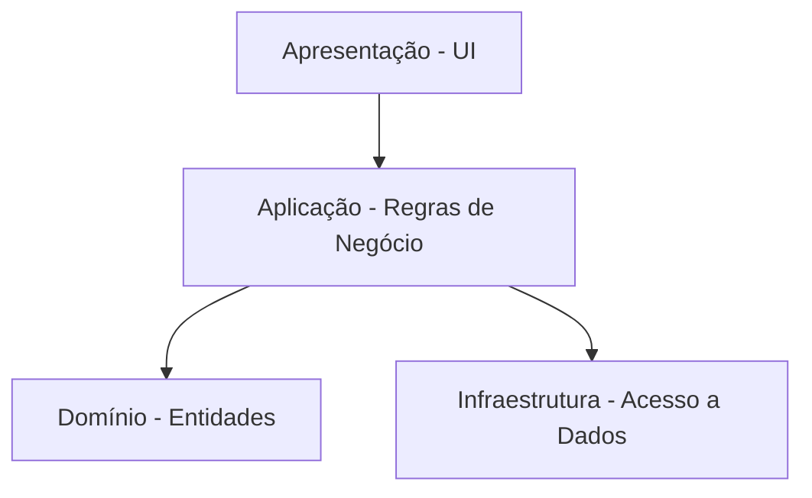
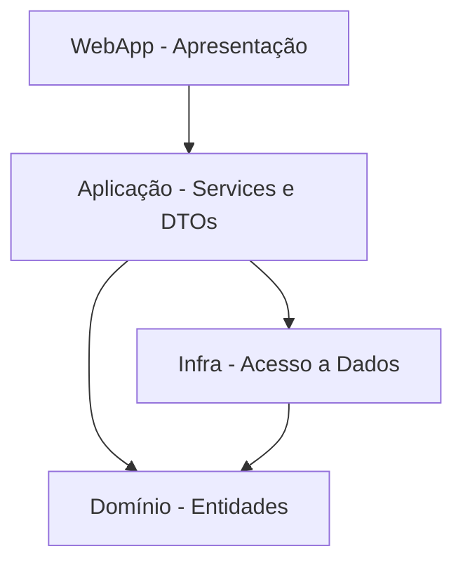
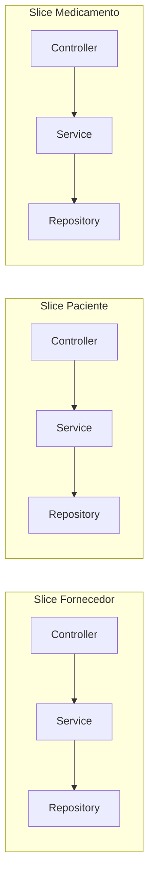
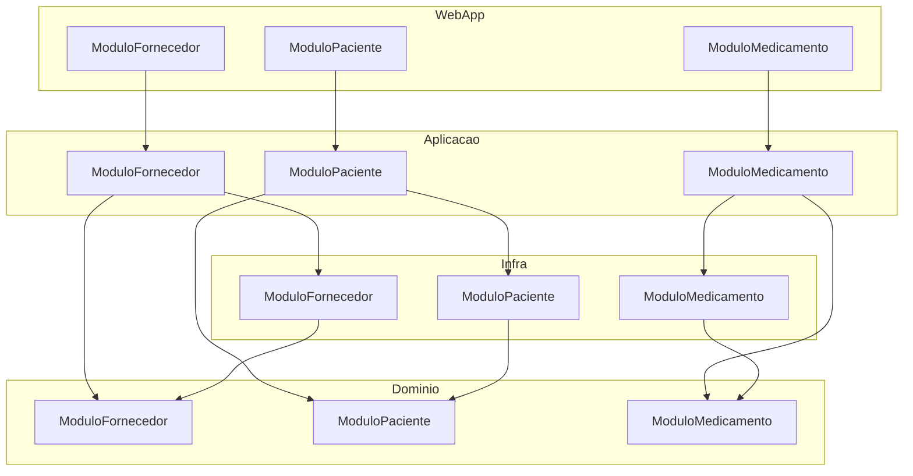

# Arquitetura N-Layer e Vertical Slices

## O problema de crescer sem organização

Até agora, construímos aplicações seguindo o padrão MVC:

- Models;
- Views;
- Controllers.

Em projetos pequenos, essa organização funciona bem.

O Controller recebe a requisição, acessa os dados, aplica regras de negócio e retorna a View.

Mas, conforme a aplicação cresce, alguns problemas começam a aparecer:

- Controllers com centenas de linhas;
- regras de negócio espalhadas entre Controllers e Views;
- lógica de acesso a dados misturada com validações;
- dificuldade para testar partes isoladas do sistema;
- uma alteração simples obriga a mexer em vários lugares.

> **Atenção:** quando um Controller faz tudo sozinho, qualquer mudança vira um risco para o sistema inteiro.

Esses problemas não são exclusivos do ASP.NET.

São consequências de não separar responsabilidades em camadas bem definidas.

Veremos duas formas de organizar uma aplicação para resolver isso:

- Arquitetura em Camadas (N-Layer);
- Vertical Slices.

---

## Arquitetura em Camadas (N-Layer)

### O que é

A arquitetura em camadas organiza o código em grupos horizontais.

Cada camada tem uma responsabilidade específica:

- uma camada para apresentação (UI);
- uma camada para regras de negócio;
- uma camada para acesso a dados.

As camadas superiores dependem das inferiores, mas nunca o contrário.

A camada de apresentação conhece a de negócio.

A camada de negócio conhece a de dados.

A camada de dados não conhece ninguém acima dela.



### O caso mais simples: 3 camadas

Nos primeiros projetos, usamos uma divisão em 3 partes:

- **Apresentação**: Controllers e Views (projeto WebApp);
- **Domínio**: Entidades e regras de validação;
- **Infraestrutura**: repositórios que acessam banco de dados.

O Controller chama o Repositório.

O Repositório retorna Entidades.

O Controller monta a View com essas entidades.

Mas essa abordagem tem uma limitação.

O Controller ainda precisa orquestrar tudo:

- chamar o repositório;
- validar dados;
- converter entidades em ViewModels;
- decidir o que fazer em caso de erro.

Isso ainda deixa regras de negócio próximas da apresentação.

### Adicionando a Camada de Aplicação

Uma quarta camada resolve esse problema: a **Camada de Aplicação**.

Ela fica entre a Apresentação e o Domínio.

Sua responsabilidade é orquestrar os casos de uso da aplicação.



Com isso, o Controller fica mais enxuto.

Ele apenas:

- recebe os dados da requisição;
- chama um Service da camada de Aplicação;
- retorna a View ou redireciona.

Toda a lógica de negócio fica nos Services.

O Controller não sabe se os dados vêm de um banco SQL, de um arquivo JSON ou de uma API externa.

Essa decisão pertence à Infraestrutura.

### Exemplo prático: módulo de Fornecedor

Vamos ver como isso funciona no projeto Controle de Medicamentos.

A estrutura de pastas dentro de cada camada segue a organização por módulos:

```text
ControleDeMedicamentosWeb.Dominio/
  Compartilhado/
    EntidadeBase.cs
    IRepositorio.cs
  Modulos/
    ModuloFornecedor/
      Fornecedor.cs
      IRepositorioFornecedor.cs

ControleDeMedicamentosWeb.Aplicacao/
  Modulos/
    ModuloFornecedor/
      ServicoFornecedor.cs
      FornecedorDtos.cs

ControleDeMedicamentosWeb.Infra/
  Modulos/
    ModuloFornecedor/
      RepositorioFornecedorSql.cs

ControleDeMedicamentosWeb.WebApp/
  Modulos/
    ModuloFornecedor/
      FornecedorController.cs
```

Cada camada está em um projeto `.csproj` separado.

Isso garante que a dependência siga sempre a direção correta.

#### Camada de Domínio

A entidade `Fornecedor` contém os dados e as regras de validação:

```csharp
namespace ControleDeMedicamentosWeb.Dominio.Modulos.ModuloFornecedor;

public class Fornecedor : EntidadeBase<Fornecedor>
{
    public string Nome { get; set; } = string.Empty;
    public string Telefone { get; set; } = string.Empty;
    public string Cnpj { get; set; } = string.Empty;

    public override List<string> Validar()
    {
        List<string> erros = [];

        if (string.IsNullOrWhiteSpace(Nome) || Nome.Length < 3 || Nome.Length > 100)
            erros.Add("O campo \"Nome\" deve conter entre 3 e 100 caracteres.");

        if (!Regex.IsMatch(Telefone, @"^\(\d{2}\) \d{4,5}-\d{4}$"))
            erros.Add("O campo \"Telefone\" deve estar no formato (DDD) 90000-0000.");

        if (!Regex.IsMatch(Cnpj, @"^\d{14}$|^\d{2}\.\d{3}\.\d{3}/\d{4}-\d{2}$"))
            erros.Add("O campo \"CNPJ\" deve estar no formato 00.000.000/0000-00.");

        return erros;
    }

    public override void Atualizar(Fornecedor entidadeAtualizada)
    {
        Nome = entidadeAtualizada.Nome;
        Telefone = entidadeAtualizada.Telefone;
        Cnpj = entidadeAtualizada.Cnpj;
    }
}
```

A interface `IRepositorioFornecedor` define o contrato de persistência:

```csharp
public interface IRepositorioFornecedor : IRepositorio<Fornecedor>
{
}
```

> A interface está no Domínio, mas a implementação está na Infraestrutura. O Domínio não sabe como os dados são salvos — só sabe que alguém vai implementar esse contrato.

#### Camada de Aplicação

Os DTOs transportam dados entre as camadas sem expor a entidade diretamente:

```csharp
namespace ControleDeMedicamentosWeb.Aplicacao.Modulos.ModuloFornecedor;

public record ListarFornecedoresDto(
    Guid Id,
    string Nome,
    string Telefone,
    string Cnpj
);

public record CadastrarFornecedorDto(
    string Nome,
    string Telefone,
    string Cnpj
);

public record EditarFornecedorDto(
    Guid Id,
    string Nome,
    string Telefone,
    string Cnpj
);

public record DetalhesFornecedorDto(
    Guid Id,
    string Nome,
    string Telefone,
    string Cnpj
);
```

> Cada operação tem seu próprio DTO. Isso evita que alterações em uma tela quebrem outras.

O `ServicoFornecedor` orquestra os casos de uso:

```csharp
public class ServicoFornecedor
{
    private readonly IRepositorioFornecedor repositorioFornecedor;

    public ServicoFornecedor(IRepositorioFornecedor repositorioFornecedor)
    {
        this.repositorioFornecedor = repositorioFornecedor;
    }

    public Result Cadastrar(CadastrarFornecedorDto dto)
    {
        Fornecedor fornecedor = new(dto.Nome, dto.Telefone, dto.Cnpj);

        List<string> erros = fornecedor.Validar();
        if (erros.Count > 0)
            return Result.Fail(erros);

        repositorioFornecedor.Cadastrar(fornecedor);

        return Result.Ok();
    }

    public Result Editar(EditarFornecedorDto dto)
    {
        Fornecedor? fornecedor = repositorioFornecedor.SelecionarPorId(dto.Id);
        if (fornecedor == null)
            return Result.Fail("Fornecedor não encontrado.");

        Fornecedor fornecedorAtualizado = new(dto.Nome, dto.Telefone, dto.Cnpj);

        List<string> erros = fornecedorAtualizado.Validar();
        if (erros.Count > 0)
            return Result.Fail(erros);

        repositorioFornecedor.Editar(dto.Id, fornecedorAtualizado);

        return Result.Ok();
    }

    public Result Excluir(Guid id)
    {
        bool excluido = repositorioFornecedor.Excluir(id);
        if (!excluido)
            return Result.Fail("Fornecedor não encontrado.");

        return Result.Ok();
    }

    public List<ListarFornecedoresDto> SelecionarTodos()
    {
        return repositorioFornecedor.SelecionarTodos()
            .Select(f => new ListarFornecedoresDto(
                f.Id, f.Nome, f.Telefone, f.Cnpj
            ))
            .ToList();
    }

    public DetalhesFornecedorDto? SelecionarPorId(Guid id)
    {
        Fornecedor? f = repositorioFornecedor.SelecionarPorId(id);
        if (f == null) return null;

        return new DetalhesFornecedorDto(
            f.Id, f.Nome, f.Telefone, f.Cnpj
        );
    }
}
```

Observe alguns pontos importantes:

- o Service recebe o repositório por injeção de dependência;
- ele não sabe se o repositório usa SQL Server, arquivo JSON ou outra tecnologia;
- o retorno usa `Result` do FluentResults para indicar sucesso ou falha;
- cada método público representa um caso de uso.

#### Registro de dependências no Program.cs

No projeto WebApp, todas as dependências são registradas no container de DI:

```csharp
var builder = WebApplication.CreateBuilder(args);

builder.Services.AddInfraRepositories();
builder.Services.AddApplicationServices(builder.Configuration, builder.Logging);
builder.Services.AddPresentationConfig(builder.Configuration);

var app = builder.Build();
```

> O `Program.cs` fica limpo porque a configuração de cada camada está encapsulada em métodos de extensão.

### Benefícios do N-Layer

- **Separação clara de responsabilidades**: cada camada tem um propósito definido;
- **Testabilidade**: é possível testar Services isoladamente com repositórios falsos (mocks);
- **Manutenção**: alterar a camada de dados não afeta a de apresentação;
- **Reaproveitamento**: Services podem ser usados por Controllers diferentes;
- **Organização**: novos desenvolvedores sabem onde cada tipo de código deve ficar.

### Limitações do N-Layer

Apesar das vantagens, a arquitetura em camadas também tem pontos de atenção:

- **Acoplamento horizontal forte**: todas as entidades de Fornecedor estão espalhadas em várias camadas;
- **Dificuldade para navegar no código**: para entender um caso de uso, é preciso abrir arquivos em vários projetos;
- **Camada de aplicação pode virar um repositório de métodos soltos**: Services genéricos que fazem de tudo.

---

## Vertical Slices

### O que é

Vertical Slices é uma forma de organizar o código por funcionalidade, não por camada técnica.

Em vez de agrupar todos os Controllers, todos os Services e todos os Repositories em pastas separadas, cada funcionalidade tem sua própria pasta com tudo o que precisa.



Cada fatia vertical contém:

- o Controller;
- o Service ou Handler;
- os DTOs;
- o repositório ou acesso a dados;
- as validações específicas.

### Exemplo prático

O projeto Controle de Medicamentos organiza os módulos por domínio, o que já é um passo nessa direção.

Cada módulo (Fornecedor, Paciente, Medicamento, Funcionário, Estoque) contém seus próprios arquivos em cada camada:

```text
Dominio/Modulos/ModuloFornecedor/
Aplicacao/Modulos/ModuloFornecedor/
Infra/Modulos/ModuloFornecedor/
WebApp/Modulos/ModuloFornecedor/
```

Isso mantém as camadas horizontais, mas agrupa o código por funcionalidade dentro de cada camada.

Em uma abordagem puramente Vertical Slices, uma funcionalidade como "Cadastrar Fornecedor" teria todos os seus arquivos em uma única pasta:

```text
Modulos/Fornecedor/Cadastrar/
  CadastrarFornecedorController.cs
  CadastrarFornecedorHandler.cs
  CadastrarFornecedorDto.cs
  CadastrarFornecedorValidator.cs
```

### Benefícios dos Vertical Slices

- **Navegação mais simples**: tudo sobre uma funcionalidade está na mesma pasta;
- **Menos acoplamento entre funcionalidades**: alterar "Cadastrar Fornecedor" não afeta "Editar Fornecedor";
- **Escalabilidade**: times diferentes podem trabalhar em slices diferentes sem conflitos;
- **Flexibilidade**: cada slice pode usar a tecnologia mais adequada para seu caso.

### Limitações dos Vertical Slices

- **Duplicação de código**: lógicas comuns podem acabar repetidas entre slices;
- **Curva de aprendizado**: exige disciplina para não quebrar o encapsulamento;
- **Integração mais complexa**: compartilhar dados entre slices exige cuidado.

---

## N-Layer + Vertical Slices: uma combinação possível

As duas abordagens não são mutuamente exclusivas.

O projeto Controle de Medicamentos usa uma combinação:

- camadas horizontais (N-Layer) para separar preocupações técnicas;
- módulos verticais (Slices) para agrupar por domínio.



As camadas garantem que a direção das dependências seja respeitada.

Os módulos garantem que o código de Fornecedor não se misture com o de Paciente.

---

## Quando usar cada abordagem

| Critério | N-Layer | Vertical Slices |
|---|---|---|
| Projeto pequeno | Funciona bem | Exagerado |
| Projeto médio | Boa organização | Começa a fazer sentido |
| Projeto grande | Camadas podem virar "gavetas" | Ajuda a dividir o trabalho |
| Muitas regras de negócio | Services genéricos podem crescer demais | Cada slice tem suas próprias regras |
| Equipe grande | Conflitos em Services compartilhados | Cada time cuida de seus slices |

> Não existe arquitetura perfeita. O importante é entender os trade-offs e escolher a que melhor resolve o problema atual.

---

## Conclusão

Organizar o código em camadas (N-Layer) resolve o problema de misturar responsabilidades.

A Camada de Aplicação, com Services e DTOs, tira a lógica de negócio dos Controllers.

Vertical Slices organiza o código por funcionalidade, deixando cada caso de uso autocontido.

O projeto Controle de Medicamentos combina as duas abordagens: camadas horizontais com módulos verticais.

Essa organização prepara o terreno para o próximo passo: arquiteturas que colocam o domínio no centro de tudo, como a Clean Architecture.