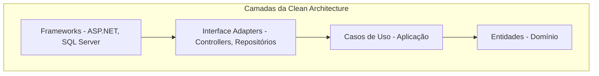
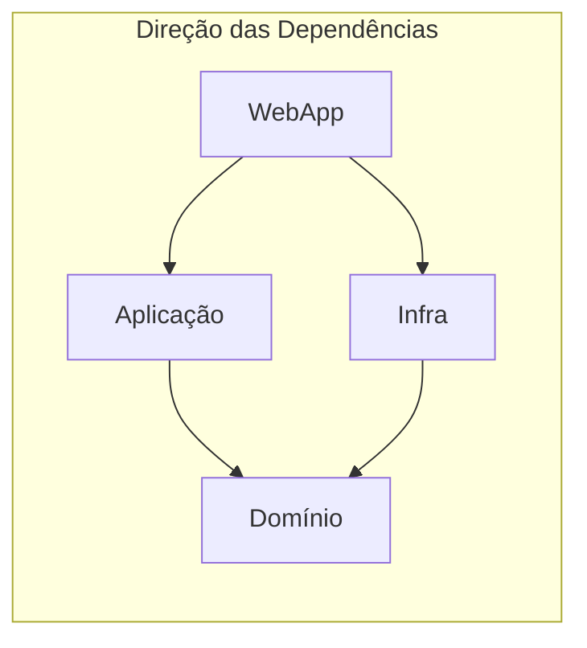
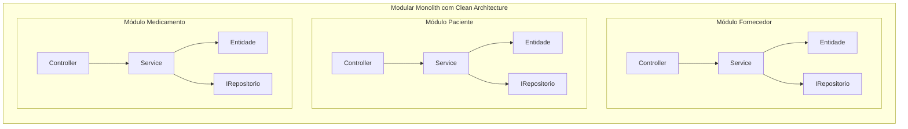

# Clean Architecture

## O que aprendemos até agora

Na aula anterior, vimos duas formas de organizar uma aplicação:

- **N-Layer**: camadas horizontais (Apresentação, Aplicação, Domínio, Infra);
- **Vertical Slices**: organização por funcionalidade.

O projeto Controle de Medicamentos usa uma combinação das duas.

Mas existe um princípio ainda mais fundamental que rege essas escolhas.

Ele se chama **Clean Architecture**.

---

## O problema que a Clean Architecture resolve

Imagine que você precisa trocar o banco de dados da aplicação.

De SQL Server para PostgreSQL.

Ou de arquivos JSON para MongoDB.

Em uma arquitetura onde tudo depende do banco, essa troca pode levar semanas.

Cada Controller, cada Service, cada View pode ter código que depende do SQL Server diretamente.

> A Clean Architecture propõe inverter essa dependência: **o banco de dados depende da aplicação, e não o contrário**.

Esse princípio é chamado de **Dependency Inversion Principle** — Inversão de Dependência.

As camadas mais internas definem contratos (interfaces).

As camadas mais externas implementam esses contratos.

Assim, trocar uma implementação externa não afeta o núcleo da aplicação.

---

## As camadas da Clean Architecture

A Clean Architecture organiza o código em círculos concêntricos.

Os círculos mais internos são os mais importantes e estáveis.

Os círculos mais externos são detalhes de infraestrutura.



### Entidades (Domínio)

As entidades encapsulam as regras de negócio mais fundamentais.

Elas não dependem de nada externo.

Não sabem se a aplicação é web, desktop ou console.

Não sabem qual banco de dados está sendo usado.

No projeto Controle de Medicamentos, a classe `Fornecedor` é uma entidade de domínio:

```csharp
public class Fornecedor : EntidadeBase<Fornecedor>
{
    public string Nome { get; set; } = string.Empty;
    public string Telefone { get; set; } = string.Empty;
    public string Cnpj { get; set; } = string.Empty;

    public override List<string> Validar()
    {
        List<string> erros = [];

        if (string.IsNullOrWhiteSpace(Nome) || Nome.Length < 3 || Nome.Length > 100)
            erros.Add("O campo \"Nome\" deve conter entre 3 e 100 caracteres.");

        if (!Regex.IsMatch(Telefone, @"^\(\d{2}\) \d{4,5}-\d{4}$"))
            erros.Add("O campo \"Telefone\" deve estar no formato (DDD) 90000-0000.");

        if (!Regex.IsMatch(Cnpj, @"^\d{14}$|^\d{2}\.\d{3}\.\d{3}/\d{4}-\d{2}$"))
            erros.Add("O campo \"CNPJ\" deve estar no formato 00.000.000/0000-00.");

        return erros;
    }
}
```

> As regras de validação estão dentro da entidade. Isso garante que um Fornecedor inválido nunca exista, independentemente de quem o criou.

A base `EntidadeBase<T>` fornece comportamentos comuns:

```csharp
public abstract class EntidadeBase<T>
{
    public Guid Id { get; set; } = Guid.CreateVersion7();
    public abstract List<string> Validar();
    public abstract void Atualizar(T entidadeAtualizada);
}
```

E a interface `IRepositorio<T>` define o contrato de persistência também no domínio:

```csharp
public interface IRepositorio<T> where T : EntidadeBase<T>
{
    void Cadastrar(T entidade);
    bool Editar(Guid idSelecionado, T entidadeAtualizada);
    bool Excluir(Guid idSelecionado);
    T? SelecionarPorId(Guid idSelecionado);
    List<T> SelecionarTodos();
    List<T> Filtrar(Predicate<T> filtro);
}
```

> O Domínio define o que precisa ser feito, mas não como. A implementação fica na camada de Infraestrutura.

### Casos de Uso (Aplicação)

A camada de Casos de Uso contém as regras específicas da aplicação.

Cada caso de uso representa uma ação que o usuário pode realizar.

No projeto, os Services da camada de Aplicação são os casos de uso:

```csharp
public class ServicoFornecedor
{
    private readonly IRepositorioFornecedor repositorioFornecedor;

    public ServicoFornecedor(IRepositorioFornecedor repositorioFornecedor)
    {
        this.repositorioFornecedor = repositorioFornecedor;
    }

    public Result Cadastrar(CadastrarFornecedorDto dto)
    {
        Fornecedor fornecedor = new(dto.Nome, dto.Telefone, dto.Cnpj);

        List<string> erros = fornecedor.Validar();
        if (erros.Count > 0)
            return Result.Fail(erros);

        repositorioFornecedor.Cadastrar(fornecedor);

        return Result.Ok();
    }
    // ... outros métodos
}
```

Observe como o caso de uso funciona:

1. Recebe um DTO com os dados de entrada.
2. Cria a entidade de domínio.
3. Valida a entidade.
4. Se inválido, retorna os erros.
5. Se válido, delega a persistência ao repositório.
6. Retorna o resultado.

A camada de Aplicação não sabe como o repositório salva os dados.

Ela só conhece a interface `IRepositorioFornecedor` definida no Domínio.

### Interface Adapters (Adaptadores)

Esta camada converte dados entre o formato externo e o formato interno.

Os Controllers são adaptadores:

- recebem dados HTTP (formulários, JSON);
- convertem para DTOs da aplicação;
- chamam o caso de uso;
- convertem o resultado para uma View ou redirecionamento.

Os repositórios concretos também são adaptadores:

- recebem chamadas do caso de uso;
- traduzem para comandos SQL (ou arquivos JSON);
- convertem os resultados de volta para entidades.

### Frameworks e Drivers

A camada mais externa contém detalhes técnicos:

- ASP.NET Core (framework web);
- SQL Server, Dapper, Entity Framework;
- sistema de arquivos;
- serviços de e-mail.

> Esses detalhes devem depender das camadas internas, nunca o contrário.

---

## A Regra de Ouro: Dependência para dentro

A regra fundamental da Clean Architecture é:

> **Dependências sempre apontam para dentro.**

Isso significa:

- a camada externa (WebApp) pode depender da Aplicação;
- a Aplicação pode depender do Domínio;
- **o Domínio não depende de nada externo**;
- **a Aplicação não depende de Infraestrutura diretamente**.



Repare que o WebApp conhece a Infraestrutura.

Mas a Infraestrutura implementa interfaces definidas no Domínio.

Isso é a inversão de dependência em ação.

### Como isso funciona na prática

Veja o `.csproj` da camada de Aplicação:

```xml
<Project Sdk="Microsoft.NET.Sdk">
  <PropertyGroup>
    <TargetFramework>net10.0</TargetFramework>
    <ImplicitUsings>enable</ImplicitUsings>
    <Nullable>enable</Nullable>
  </PropertyGroup>

  <ItemGroup>
    <PackageReference Include="FluentResults" Version="4.0.0" />
  </ItemGroup>

  <ItemGroup>
    <ProjectReference Include="..\ControleDeMedicamentosWeb.Dominio\..." />
  </ItemGroup>
</Project>
```

A Aplicação referencia apenas o Domínio.

Não referencia a Infraestrutura.

Nem o ASP.NET.

Nem o Dapper.

Isso significa que a Aplicação pode ser testada sem banco de dados, sem servidor web, sem dependências externas.

E o `.csproj` da Infraestrutura:

```xml
<Project Sdk="Microsoft.NET.Sdk">
  <PropertyGroup>
    <TargetFramework>net10.0</TargetFramework>
  </PropertyGroup>

  <ItemGroup>
    <PackageReference Include="Dapper" Version="2.1.79" />
    <PackageReference Include="Microsoft.Data.SqlClient" Version="7.0.1" />
  </ItemGroup>

  <ItemGroup>
    <ProjectReference Include="..\ControleDeMedicamentosWeb.Dominio\..." />
  </ItemGroup>
</Project>
```

A Infraestrutura também referencia apenas o Domínio.

Ela conhece Dapper e SQL Server, mas essas dependências não vazam para outras camadas.

---

## Mapeando para o projeto Controle de Medicamentos

O projeto da branch `architecture` aplica os princípios da Clean Architecture:

| Camada Clean Architecture | Projeto no .NET | Responsabilidade |
|---|---|---|
| Entidades | `ControleDeMedicamentosWeb.Dominio` | Entidades, validações, interfaces de repositório |
| Casos de Uso | `ControleDeMedicamentosWeb.Aplicacao` | Services, DTOs, orquestração |
| Adaptadores | `ControleDeMedicamentosWeb.Infra` | Repositórios concretos, acesso a dados |
| Adaptadores | `ControleDeMedicamentosWeb.WebApp` | Controllers, Views |
| Frameworks | `ControleDeMedicamentosWeb.WebApp` | ASP.NET Core, configuração |
| Frameworks | `ControleDeMedicamentosWeb.Database` | Scripts SQL, migrações |

A estrutura de projetos no arquivo `.slnx`:

```xml
<Solution>
  <Project Path="ControleDeMedicamentosWeb.Aplicacao/..." />
  <Project Path="ControleDeMedicamentosWeb.Dominio/..." />
  <Project Path="ControleDeMedicamentosWeb.Infra/..." />
  <Project Path="ControleDeMedicamentosWeb.WebApp/..." />
</Solution>
```

### O papel do Program.cs

O `Program.cs` é o ponto onde todas as dependências são conectadas:

```csharp
var builder = WebApplication.CreateBuilder(args);

// Infraestrutura
builder.Services.AddInfraRepositories();

// Aplicação (Casos de Uso)
builder.Services.AddApplicationServices(builder.Configuration, builder.Logging);

// Apresentação
builder.Services.AddPresentationConfig(builder.Configuration);

// Health Check
builder.Services.AddHealthChecks()
    .AddCheck<SqlServerHealthCheck>("sqlserver-db-check", tags: ["ready"]);

var app = builder.Build();

app.UseStaticFiles();
app.UseRouting();
app.MapDefaultControllerRoute();
app.MapHealthChecks("/health");

app.Run();
```

Cada método de extensão (`AddInfraRepositories`, `AddApplicationServices`, `AddPresentationConfig`) encapsula o registro de dependências da sua camada.

O `Program.cs` não sabe quais repositórios existem ou quais Services precisam ser registrados.

Ele apenas chama os métodos de configuração de cada camada.

> Isso mantém o ponto de entrada da aplicação limpo e coeso.

---

## Benefícios da Clean Architecture

### Independência de framework

O Domínio e a Aplicação não dependem do ASP.NET Core.

Se no futuro você quiser migrar para outro framework, as regras de negócio continuam as mesmas.

### Independência de banco de dados

A Aplicação depende de interfaces, não de implementações concretas.

O mesmo `ServicoFornecedor` pode funcionar com:

- SQL Server (via Dapper);
- arquivos JSON (via `System.Text.Json`);
- Entity Framework;
- qualquer outra tecnologia de persistência.

Basta implementar `IRepositorioFornecedor` com a tecnologia desejada.

### Testabilidade

Como as dependências são injetadas, é possível testar cada camada isoladamente:

```csharp
// Exemplo conceitual de teste do ServicoFornecedor
[Test]
public void Deve_Cadastrar_Fornecedor_Com_Dados_Validos()
{
    // Arrange: repositório falso (mock)
    var repositorioMock = new RepositorioFornecedorFake();
    var servico = new ServicoFornecedor(repositorioMock);
    var dto = new CadastrarFornecedorDto("Fornecedor X", "(11) 90000-0000", "12345678000199");

    // Act
    var resultado = servico.Cadastrar(dto);

    // Assert
    Assert.IsTrue(resultado.IsSuccess);
    Assert.AreEqual(1, repositorioMock.SelecionarTodos().Count);
}
```

> Não é necessário subir um banco de dados real para testar regras de negócio.

### Manutenção

Alterar a camada de infraestrutura não afeta as regras de negócio.

Adicionar um novo campo em uma entidade é uma mudança localizada no Domínio.

Trocar a biblioteca de acesso a dados afeta apenas a Infraestrutura.

---

## Desafios da Clean Architecture

Nem tudo são vantagens. A Clean Architecture também tem seus custos:

- **Mais projetos e arquivos**: cada camada é um projeto separado, o que aumenta a complexidade inicial;
- **Curva de aprendizado**: entender inversão de dependência exige prática;
- **Overhead para projetos pequenos**: para um CRUD simples, tantas camadas podem ser excessivas;
- **Mapeamento entre camadas**: é preciso converter entidades em DTOs e vice-versa, o que gera código adicional.

> Para projetos pequenos, a Clean Architecture pode ser um exagero. Mas para sistemas que vão crescer e evoluir, o investimento inicial se paga com juros.

---

## Clean Architecture e Vertical Slices juntos

O projeto Controle de Medicamentos mostra que essas abordagens podem ser combinadas.

A Clean Architecture define a direção das dependências e a separação de responsabilidades.

A organização por módulos (Vertical Slices) agrupa o código por domínio.



Cada módulo segue a mesma estrutura de camadas.

Cada módulo tem suas próprias entidades, serviços, DTOs e repositórios.

O resultado é um código organizado, testável e preparado para crescer.

---

## Resumo: os princípios essenciais

A Clean Architecture se apoia em alguns pilares:

1. **Separação de responsabilidades**: cada camada tem um papel bem definido.
2. **Dependência para dentro**: camadas externas dependem das internas, nunca o contrário.
3. **Inversão de dependência**: o Domínio define interfaces; a Infraestrutura as implementa.
4. **Independência de detalhes**: frameworks, bancos de dados e bibliotecas são detalhes substituíveis.
5. **Testabilidade**: cada camada pode ser testada isoladamente.

> Você não precisa aplicar todos esses princípios de uma vez. A evolução natural de um projeto bem organizado tende a se aproximar da Clean Architecture com o tempo.

---

## Conclusão

A Clean Architecture é uma evolução natural das arquiteturas em camadas.

Ela coloca o domínio no centro e trata infraestrutura como detalhe.

O projeto Controle de Medicamentos aplica esses princípios com:

- Domínio isolado, sem dependências externas;
- Casos de uso na camada de Aplicação;
- Repositórios concretos na Infraestrutura;
- Controllers enxutos no WebApp;
- Dependências sempre apontando para dentro.

Essa organização não é um fim em si mesma.

É um meio para construir sistemas que possam evoluir sem se transformar em uma bola de lama.

Compreender esses princípios ajuda a tomar decisões conscientes sobre onde colocar cada pedaço de código — mesmo em projetos que não sigam a Clean Architecture à risca.