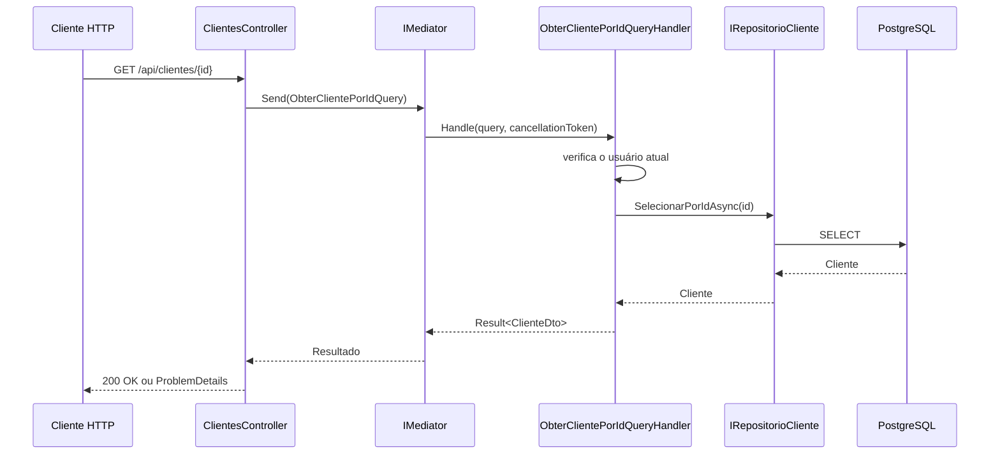

# CQRS e Mediator com MediatR

## O problema de concentrar todos os métodos em um Service

Em uma aplicação pequena, podemos criar um Service para cada entidade:

```csharp
public class ServicoCliente
{
    public Result Cadastrar(CadastrarClienteDto dto)
    {
        // regras de cadastro
    }

    public Result<ClienteDto> SelecionarPorId(Guid id)
    {
        // regras de consulta
    }

    public Result Editar(Guid id, EditarClienteDto dto)
    {
        // regras de edição
    }

    public Result Excluir(Guid id)
    {
        // regras de exclusão
    }
}
```

Esse código funciona.

Porém, conforme o módulo cresce, o Service começa a reunir operações muito diferentes:

- comandos que alteram dados;
- consultas que apenas leem dados;
- regras de autorização;
- conversões para DTOs;
- validações específicas de cada operação.

O resultado pode ser uma classe grande, com muitos métodos e muitas dependências.

Também fica mais difícil identificar o objetivo de cada operação apenas olhando para o Service.

Na `v2` do [Delivery App](https://github.com/academiadoprogramador-fullstack/delivery-app-2026/tree/v2), o projeto começa a separar essas responsabilidades usando **CQRS** e o padrão **Mediator**.

---

## O que é CQRS?

CQRS significa **Command Query Responsibility Segregation**.

Em português, podemos traduzir como **Segregação de Responsabilidade entre Comandos e Consultas**.

A ideia principal é separar dois tipos de operação:

- **Command**: solicita uma mudança no estado da aplicação;
- **Query**: solicita informações sem alterar o estado da aplicação.

```text
Command
  -> altera dados
  -> pode criar, editar ou excluir

Query
  -> consulta dados
  -> não deve alterar o estado
```

> CQRS separa a intenção da operação: uma mensagem pede uma mudança ou uma consulta, mas não as duas coisas ao mesmo tempo.

### Commands

Um Command representa uma ação que modifica o sistema.

Exemplos:

- cadastrar cliente;
- editar estabelecimento;
- ativar produto;
- criar pedido;
- cancelar pedido.

O Command carrega os dados necessários para realizar a ação.

Ele não precisa conhecer o Controller, o banco de dados ou o próprio Handler.

### Queries

Uma Query representa uma leitura.

Exemplos:

- obter um cliente por ID;
- listar estabelecimentos disponíveis;
- consultar os produtos de um estabelecimento;
- buscar os detalhes de um pedido.

Uma Query pode retornar um DTO especialmente preparado para a consulta.

Ela não deve cadastrar, editar ou excluir dados como efeito colateral.

---

## CQRS não exige dois bancos de dados

É comum encontrar exemplos de CQRS com dois bancos:

- um banco otimizado para escrita;
- um banco otimizado para leitura.

Essa é uma possibilidade mais avançada, mas não é uma exigência do padrão.

No Delivery App, a `v2` utiliza o mesmo `DeliveryAppDbContext` e o mesmo banco PostgreSQL para Commands e Queries.

A separação acontece no código e na responsabilidade de cada caso de uso.

```text
mesmo banco
   ├── CadastrarClienteCommandHandler
   └── ObterClientePorIdQueryHandler
```

Esse formato é chamado, muitas vezes, de **CQRS no nível da aplicação**.

Ele já traz benefícios de organização sem exigir uma arquitetura distribuída.

> Primeiro aprendemos a separar as responsabilidades. A separação física dos dados só deve ser adicionada quando existir uma necessidade real.

---

## Como o Delivery App organiza os casos de uso

Na branch `v2`, os casos de uso de clientes ficam em:

```text
src/Aplicacao/
└── Modulos/
    └── Clientes/
        ├── CadastrarClienteCommandHandler.cs
        ├── ClienteDto.cs
        └── ObterClientePorIdQueryHandler.cs
```

Cada arquivo contém uma mensagem e seu Handler.

Essa organização combina:

- separação por módulo, neste caso `Clientes`;
- separação por caso de uso;
- dependência de abstrações do domínio;
- respostas representadas por `FluentResults`.

O projeto de aplicação não depende do ASP.NET Core MVC.

Ele conhece `IRequest`, `IRequestHandler` e `IMediator`, que pertencem à biblioteca MediatR.

Não conhece `ControllerBase`, `HttpContext` ou códigos de status HTTP.

---

## Criando um Command

O cadastro de cliente é uma operação que altera o estado da aplicação.

Por isso, ele é representado por um Command:

```csharp
public sealed record CadastrarClienteCommand(
    Guid Id,
    string Nome,
    string Cpf
) : IRequest<Result>;
```

Esse `record` possui os dados necessários para o caso de uso.

Observe a implementação de `IRequest<Result>`:

```csharp
: IRequest<Result>
```

Isso informa que o Command será processado por um Handler que retornará `Result`.

O `Result` indica se a operação terminou com sucesso ou falha.

O Command não possui um método `Executar`.

Ele apenas transporta a intenção e seus dados.

### Por que usar um `record`?

Um `record` é adequado para representar uma mensagem:

- possui uma estrutura simples;
- deixa claro quais dados a operação recebe;
- não reúne regras de persistência;
- pode ser criado diretamente no Controller ou em outro componente.

O Command também pode ser uma classe comum. O `record` é uma escolha conveniente para objetos de transporte imutáveis.

---

## Criando o Command Handler

O Handler contém o caso de uso do cadastro:

```csharp
public sealed class CadastrarClienteCommandHandler(
    IRepositorioCliente repositorioCliente
) : IRequestHandler<CadastrarClienteCommand, Result>
{
    public async Task<Result> Handle(
        CadastrarClienteCommand command,
        CancellationToken cancellationToken = default
    )
    {
        var cliente = new Cliente(
            command.Id,
            command.Nome,
            command.Cpf
        );

        var erros = cliente.Validar();

        if (erros.Count > 0)
        {
            var resultado = Result.Ok();

            foreach (ErroValidacao erro in erros)
            {
                resultado.WithError(
                    TipoErro.Validacao.ObterMetadados(
                        erro.Campo,
                        erro.Mensagem
                    )
                );
            }

            return resultado;
        }

        var clientes = await repositorioCliente
            .SelecionarTodosAsync(cancellationToken);

        if (clientes.Any(registro => registro.Cpf == cliente.Cpf))
        {
            return Result.Fail(
                new Error("Um cliente com este CPF já foi cadastrado.")
                    .WithMetadata(nameof(TipoErro), TipoErro.Conflito)
            );
        }

        await repositorioCliente
            .CadastrarAsync(cliente, cancellationToken);

        return Result.Ok();
    }
}
```

Vamos observar esse código por partes.

### Construção da entidade

O Handler recebe o Command e cria a entidade de domínio:

```csharp
var cliente = new Cliente(
    command.Id,
    command.Nome,
    command.Cpf
);
```

O Command transporta os dados.

A entidade representa o objeto que será validado e persistido.

### Validação do domínio

O Handler chama a validação da entidade:

```csharp
var erros = cliente.Validar();
```

A entidade conhece suas regras, como:

- nome entre 2 e 100 caracteres;
- CPF com 11 dígitos;
- formato válido dos seus dados.

O Handler transforma cada `ErroValidacao` em um erro do `FluentResults`.

Ele não converte o erro para `400 Bad Request`.

Essa decisão pertence à camada Web API.

### Verificação de conflito

Depois da validação, o Handler verifica se outro cliente possui o mesmo CPF:

```csharp
if (clientes.Any(registro => registro.Cpf == cliente.Cpf))
{
    return Result.Fail(
        new Error("Um cliente com este CPF já foi cadastrado.")
            .WithMetadata(nameof(TipoErro), TipoErro.Conflito)
    );
}
```

Esse é um conflito de negócio, não uma validação de formato.

Por isso, o resultado recebe `TipoErro.Conflito`.

Mais tarde, o Controller ou uma extensão da Web API poderá converter esse tipo em `409 Conflict`.

### Persistência assíncrona

O Handler envia o cliente ao repositório:

```csharp
await repositorioCliente
    .CadastrarAsync(cliente, cancellationToken);
```

O `CancellationToken` permite cancelar a operação quando a requisição HTTP for interrompida.

O Handler não conhece a implementação do repositório.

Ele depende de `IRepositorioCliente`, uma abstração definida no domínio.

---

## Criando uma Query

Agora vamos consultar um cliente por ID.

Essa operação não deve alterar dados.

Por isso, ela é representada por uma Query:

```csharp
public sealed record ObterClientePorIdQuery(
    Guid ClienteId
) : IRequest<Result<ClienteDto>>;
```

Observe a diferença no retorno:

```csharp
IRequest<Result<ClienteDto>>
```

A Query retorna um `Result` que contém `ClienteDto` em caso de sucesso.

O DTO representa a forma dos dados que o caso de uso deseja devolver:

```csharp
public record ClienteDto(
    Guid Id,
    string Nome,
    string Cpf,
    string Email
);
```

O DTO não é a entidade do banco.

Ele é o resultado específico da consulta.

---

## Criando o Query Handler

O Handler da Query recebe o repositório e o provedor do usuário:

```csharp
public sealed class ObterClientePorIdQueryHandler(
    IRepositorioCliente repositorioCliente,
    IProvedorDeUsuario provedorDeUsuario
) : IRequestHandler<ObterClientePorIdQuery, Result<ClienteDto>>
```

O método `Handle` começa verificando a autorização do caso de uso:

```csharp
if (query.ClienteId != provedorDeUsuario.Id)
{
    return Result.Fail<ClienteDto>(
        new Error(
            "Um cliente pode acessar apenas suas próprias informações."
        )
        .WithMetadata(nameof(TipoErro), TipoErro.NaoAutorizado)
    );
}
```

Essa regra não está no Controller.

Ela pertence ao caso de uso de consultar um cliente.

Depois, o Handler consulta o repositório:

```csharp
var cliente = await repositorioCliente
    .SelecionarPorIdAsync(
        query.ClienteId,
        cancellationToken
    );
```

Se não encontrar o registro, retorna outro tipo de erro:

```csharp
if (cliente is null)
{
    return Result.Fail<ClienteDto>(
        new Error("O cliente com este ID não foi encontrado.")
            .WithMetadata(
                nameof(TipoErro),
                TipoErro.NaoEncontrado
            )
    );
}
```

Em caso de sucesso, o Handler monta o DTO:

```csharp
return Result.Ok(new ClienteDto(
    cliente.Id,
    cliente.Nome,
    cliente.Cpf,
    provedorDeUsuario.Email!
));
```

O resultado da Query não expõe diretamente a entidade de domínio.

Isso permite que a resposta contenha exatamente os dados necessários para esse caso de uso.

---

## Comparando Command e Query

| Característica | Command | Query |
|---|---|---|
| Intenção | Alterar o estado | Consultar informações |
| Exemplos | Cadastrar, editar, excluir | Obter, listar, filtrar |
| Retorno | Resultado da operação | Dados consultados ou falha |
| Regra principal | Pode modificar dados | Não deve modificar dados |
| Exemplo da `v2` | `CadastrarClienteCommand` | `ObterClientePorIdQuery` |
| Handler | `CadastrarClienteCommandHandler` | `ObterClientePorIdQueryHandler` |

Essa tabela não é uma regra para nomes.

Ela representa a intenção de cada mensagem.

Uma Query não deve ser chamada de Query apenas porque retorna uma lista. Ela precisa representar uma leitura sem efeito colateral.

Da mesma forma, um Command representa uma solicitação de mudança, mesmo que retorne apenas um ID ou um `Result` vazio.

---

## O que é o padrão Mediator?

O padrão Mediator cria um objeto intermediário para organizar a comunicação entre componentes.

Sem um Mediator, o Controller poderia conhecer diretamente o Handler:

```csharp
public class ClientesController(
    CadastrarClienteCommandHandler handler
)
{
    public async Task Cadastrar(...)
    {
        var comando = new CadastrarClienteCommand(...);

        var resultado = await handler.Handle(comando);
    }
}
```

Isso gera alguns problemas:

- o Controller precisa conhecer o tipo concreto do Handler;
- cada nova operação adiciona mais dependências ao Controller;
- a apresentação fica acoplada à implementação dos casos de uso;
- a forma de localizar o Handler fica espalhada pelo código.

Com o Mediator, o Controller envia uma mensagem:

```text
Controller
   -> IMediator.Send(mensagem)
      -> Mediator localiza o Handler
         -> Handler executa o caso de uso
            -> Result retorna ao Controller
```

O Controller conhece apenas a abstração `IMediator`.

O Mediator conhece o tipo da mensagem e encaminha a execução para o Handler registrado.

> O Mediator não executa a regra de negócio. Ele apenas encaminha a mensagem para o Handler responsável.

---

## Instalando o MediatR

O MediatR é uma biblioteca que implementa o padrão Mediator para aplicações .NET.

Na branch `v2`, o pacote está no projeto `DeliveryApp.Aplicacao`:

```xml
<PackageReference Include="MediatR" Version="14.2.0" />
```

Caso seja necessário adicionar o pacote manualmente:

```bash
dotnet add src/Aplicacao/DeliveryApp.Aplicacao.csproj package MediatR --version 14.2.0
```

O projeto da aplicação é o local correto para o pacote porque Commands, Queries e Handlers pertencem à camada de aplicação.

O projeto de domínio não precisa depender do MediatR.

---

## Registrando os Handlers no container de dependências

Adicionar o pacote não é suficiente.

O MediatR precisa saber quais Handlers existem.

Na `v2`, isso é configurado em `src/Aplicacao/DependencyInjection.cs`:

```csharp
using Microsoft.Extensions.DependencyInjection;

namespace DeliveryApp.Aplicacao;

public static class DependencyInjection
{
    public static void AddApplicationServices(
        this IServiceCollection services
    )
    {
        services.AddMediatR(config =>
        {
            config.RegisterServicesFromAssembly(
                typeof(DependencyInjection).Assembly
            );
        });
    }
}
```

`RegisterServicesFromAssembly` solicita que o MediatR procure mensagens e Handlers na assembly do projeto de aplicação.

Assim, quando criamos um novo Handler dentro desse projeto, não precisamos registrá-lo individualmente:

```csharp
services.AddTransient<CadastrarClienteCommandHandler>();
services.AddTransient<ObterClientePorIdQueryHandler>();
```

Esses registros manuais não aparecem na `v2`.

O MediatR realiza a descoberta e registra as dependências necessárias.

### Chamando a extensão no projeto da API

O `Program.cs` chama a extensão durante a configuração dos serviços:

```csharp
builder.Services.AddApplicationServices();
```

O fluxo de inicialização fica assim:

```text
Program.cs
   -> AddApplicationServices()
      -> AddMediatR(...)
         -> descoberta dos Handlers
            -> registro no container de DI
```

Depois disso, o ASP.NET Core consegue fornecer `IMediator` para os Controllers.

---

## Enviando uma Query pelo Controller

O `ClientesController` recebe `IMediator` no construtor:

```csharp
public sealed class ClientesController(
    UserManager<IdentityUser<Guid>> userManager,
    SignInManager<IdentityUser<Guid>> signInManager,
    RoleManager<IdentityRole<Guid>> roleManager,
    JwtProvider jwtProvider,
    IMediator mediator
) : ControllerBase
```

A Action de consulta cria a Query e envia a mensagem:

```csharp
[Authorize(Roles = nameof(TipoUsuario.Cliente))]
[HttpGet("{clienteId:guid}")]
public async Task<ActionResult<ClienteResponse>> ObterPorId(
    Guid clienteId,
    CancellationToken cancellationToken
)
{
    var resultado = await mediator.Send(
        new ObterClientePorIdQuery(clienteId),
        cancellationToken
    );

    if (resultado.IsFailed)
        return this.ProblemDetails(resultado);

    var response = new ClienteResponse(
        resultado.Value.Id,
        resultado.Value.Nome,
        resultado.Value.Cpf,
        resultado.Value.Email
    );

    return Ok(response);
}
```

O Controller fica responsável por preocupações HTTP:

- receber o parâmetro da rota;
- criar a Query;
- enviar a mensagem;
- converter falhas em `ProblemDetails`;
- converter o DTO da aplicação em resposta HTTP;
- devolver `200 OK`.

O Handler fica responsável pelo caso de uso:

- conferir se o usuário pode acessar o cliente;
- consultar o repositório;
- decidir quando o cliente não existe;
- montar o `ClienteDto`.

Essa divisão mantém cada camada focada em sua própria responsabilidade.

---

## Enviando um Command pelo Controller

No cadastro, o Controller possui duas responsabilidades relacionadas, mas diferentes.

Primeiro, cria o usuário do ASP.NET Core Identity.

Depois, envia um Command para criar o perfil `Cliente` no domínio:

```csharp
var resultadoCliente = await mediator.Send(
    new CadastrarClienteCommand(
        id,
        request.Nome,
        request.Cpf
    )
);

if (!resultadoCliente.IsSuccess)
    return this.ProblemDetails(resultadoCliente);
```

O cadastro do usuário e da senha continua utilizando `UserManager`.

O cadastro do perfil de domínio é delegado ao Handler.

O `CadastrarClienteRequest` da API possui `Nome`, `Cpf`, `Email` e `Senha`.

O `CadastrarClienteCommand` possui apenas `Id`, `Nome` e `Cpf` porque email e senha pertencem ao fluxo do Identity nesse caso.

Essa diferença mostra que cada camada pode possuir um modelo próprio:

```text
JSON HTTP
  -> CadastrarClienteRequest
    -> CadastrarClienteCommand
      -> Cliente
        -> banco de dados
```

O Controller não envia diretamente o request HTTP para o domínio.

Ele cria a mensagem específica do caso de uso.

---

## O fluxo completo de uma requisição

Considere a requisição:

```text
GET /api/clientes/{clienteId}
```

O fluxo pode ser representado assim:



O Controller não chama o repositório diretamente.

O Mediator não conhece regras de autorização.

O Handler não conhece códigos HTTP.

Cada parte realiza uma tarefa diferente.

---

## O que permanece fora do MediatR?

O MediatR não substitui todas as abstrações da aplicação.

Ele não é:

- um banco de dados;
- um ORM;
- um sistema de filas;
- uma ferramenta de autenticação;
- um substituto para as entidades de domínio;
- uma forma automática de validar todas as regras.

O MediatR apenas encaminha mensagens dentro do mesmo processo.

Nesse fluxo, não existe uma fila externa nem uma execução em outro servidor.

```text
mesmo processo da API
  Controller -> Mediator -> Handler
```

O repositório continua responsável pelo acesso ao banco.

O domínio continua responsável por suas regras.

O ASP.NET Core continua responsável pelo HTTP.

---

## Benefícios da combinação entre CQRS e Mediator

Separar Commands e Queries com MediatR pode trazer benefícios como:

- cada caso de uso possui um ponto de entrada claro;
- Commands e Queries não misturam intenções diferentes;
- Controllers ficam menores;
- dependências são organizadas por operação;
- Handlers podem ser testados isoladamente;
- novos casos de uso não exigem um Service centralizado cada vez maior;
- a estrutura combina bem com Vertical Slices.

No Delivery App, a estrutura por módulo fica assim:

```text
Clientes
  ├── CadastrarClienteCommandHandler.cs
  ├── ObterClientePorIdQueryHandler.cs
  └── ClienteDto.cs
```

Quando outros módulos forem adicionados, cada um poderá ter seus próprios Commands, Queries e Handlers:

```text
Aplicacao/
└── Modulos/
    ├── Clientes/
    ├── Estabelecimentos/
    ├── Cardapio/
    └── Pedidos/
```

---

## Cuidados ao aplicar CQRS

CQRS não deve ser usado apenas para trocar o nome de métodos.

Criar uma classe para cada método sem separar responsabilidades pode aumentar a quantidade de arquivos sem melhorar o design.

Antes de criar um Command ou Query, pergunte:

- essa operação altera o estado?
- essa operação apenas consulta dados?
- quais regras pertencem a esse caso de uso?
- qual é o resultado esperado?
- quais dependências o Handler realmente precisa?

Também devemos evitar Handlers gigantes.

Se um Handler começa a coordenar muitos casos de uso diferentes, provavelmente existem responsabilidades que precisam ser separadas.

Outro cuidado é não colocar regras HTTP no Handler:

```csharp
// Evite dentro do Handler
return BadRequest();
```

O Handler deve retornar um resultado da aplicação:

```csharp
return Result.Fail(
    new Error("O cliente não foi encontrado.")
        .WithMetadata(nameof(TipoErro), TipoErro.NaoEncontrado)
);
```

O Controller ou uma extensão da Web API transforma esse resultado em `404 Not Found`.

---

## Testando um Handler isoladamente

Como o Handler depende de interfaces, podemos testá-lo sem iniciar a API ou o PostgreSQL.

Um teste do `ObterClientePorIdQueryHandler` pode fornecer:

- um repositório falso;
- um provedor de usuário falso;
- uma Query com um ID conhecido.

O cenário de autorização pode ser verificado assim:

```csharp
[TestMethod]
public async Task NaoDevePermitirAcessoAOutroCliente()
{
    var provedor = new ProvedorDeUsuarioFake
    {
        Id = Guid.NewGuid()
    };

    var outroClienteId = Guid.NewGuid();
    var repositorio = new RepositorioClienteFake();

    var handler = new ObterClientePorIdQueryHandler(
        repositorio,
        provedor
    );

    var resultado = await handler.Handle(
        new ObterClientePorIdQuery(outroClienteId)
    );

    Assert.IsTrue(resultado.IsFailed);
    Assert.AreEqual(
        TipoErro.NaoAutorizado,
        resultado.Errors[0].Metadata[nameof(TipoErro)]
    );
}
```

O teste verifica a regra do caso de uso.

Ele não precisa verificar se o ASP.NET encontrou a rota correta.

Essa separação torna o teste mais rápido e mais focado.

---

## Exercício: migrando um Service para CQRS

Utilize a branch `v2` do Delivery App como referência.

1. Localize o projeto `src/Aplicacao`.
2. Confirme se o pacote `MediatR` está instalado.
3. Leia `DependencyInjection.cs` e identifique o registro dos Handlers.
4. Leia `CadastrarClienteCommandHandler.cs`.
5. Separe mentalmente as etapas de validação, conflito e persistência.
6. Leia `ObterClientePorIdQueryHandler.cs`.
7. Identifique a regra que impede um cliente de consultar outro cliente.
8. Leia `ClientesController.cs` e localize as chamadas a `mediator.Send`.
9. Crie um `ListarEstabelecimentosQuery` que retorne `Result<List<EstabelecimentoDto>>`.
10. Crie o `ListarEstabelecimentosQueryHandler` usando `IRepositorioEstabelecimento`.
11. Registre o novo caso de uso apenas mantendo o scan da assembly.
12. Adicione uma Action no Controller que envie a Query.
13. Retorne `ProblemDetails` quando o resultado for uma falha.

Ao finalizar, verifique:

- o Controller conhece apenas `IMediator` para enviar a mensagem;
- a Query não altera dados;
- o Handler não retorna `IActionResult`;
- o repositório continua sendo uma abstração do domínio;
- o `CancellationToken` é encaminhado até a operação assíncrona.

---

## Conclusão

CQRS separa as operações de escrita das operações de leitura.

No Delivery App:

- `CadastrarClienteCommand` representa uma alteração;
- `CadastrarClienteCommandHandler` executa o cadastro;
- `ObterClientePorIdQuery` representa uma consulta;
- `ObterClientePorIdQueryHandler` executa a leitura;
- `IMediator` encaminha cada mensagem ao Handler correspondente;
- `AddMediatR` registra os Handlers encontrados na assembly da aplicação;
- o Controller continua responsável pela comunicação HTTP;
- o domínio continua responsável pelas regras centrais.

O resultado é uma aplicação em que cada caso de uso possui uma responsabilidade mais clara.

Essa organização não elimina a necessidade de pensar sobre arquitetura.

Ela oferece uma estrutura para que o crescimento da aplicação não transforme um único Service em um ponto de concentração de regras diferentes.

Referências:

- [Containerização com Docker e Início do Delivery App](/conteudo/containerizacao-docker-inicio-delivery-app);
- [Projeto Delivery App na branch `v2`](https://github.com/academiadoprogramador-fullstack/delivery-app-2026/tree/v2);
- [`DependencyInjection.cs` da Aplicação](https://github.com/academiadoprogramador-fullstack/delivery-app-2026/blob/v2/src/Aplicacao/DependencyInjection.cs);
- [`CadastrarClienteCommandHandler.cs`](https://github.com/academiadoprogramador-fullstack/delivery-app-2026/blob/v2/src/Aplicacao/Modulos/Clientes/CadastrarClienteCommandHandler.cs);
- [`ObterClientePorIdQueryHandler.cs`](https://github.com/academiadoprogramador-fullstack/delivery-app-2026/blob/v2/src/Aplicacao/Modulos/Clientes/ObterClientePorIdQueryHandler.cs);
- [`ClientesController.cs`](https://github.com/academiadoprogramador-fullstack/delivery-app-2026/blob/v2/src/Api/Modulos/Clientes/ClientesController.cs);
- [`DeliveryApp.Aplicacao.csproj`](https://github.com/academiadoprogramador-fullstack/delivery-app-2026/blob/v2/src/Aplicacao/DeliveryApp.Aplicacao.csproj);
- [Documentação do MediatR](https://github.com/jbogard/MediatR).
