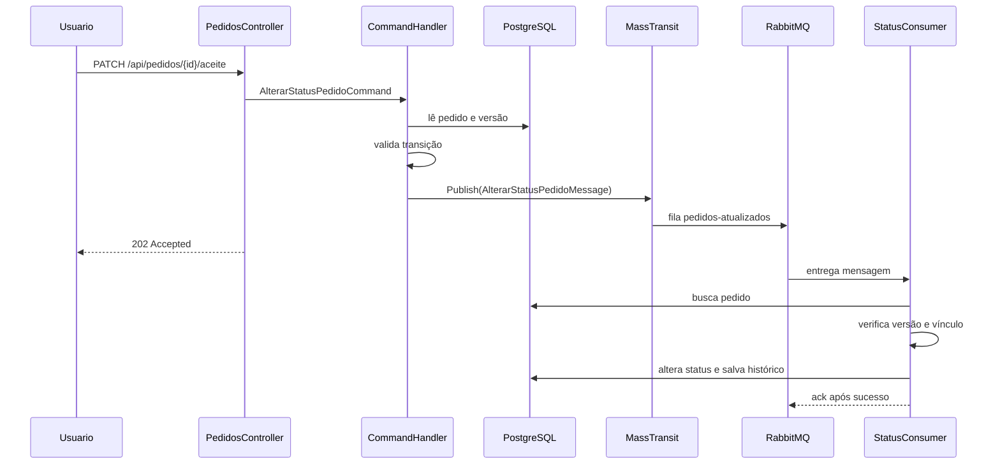

# Alteração de Status de Pedidos com Mensageria

## Continuando o módulo de Pedidos

Na aula anterior, o Delivery App passou a criar pedidos de forma assíncrona.

O fluxo principal ficou assim:

```text
cliente
  -> API
    -> CriarPedidoCommand
      -> CriarPedidoMessage
        -> fila pedidos-criados
          -> CriarPedidoConsumer
            -> salva o pedido
```

Depois que o pedido é criado, ele precisa avançar pelo seu ciclo de vida.

O estabelecimento pode aceitar ou recusar o pedido.

O cliente pode cancelá-lo enquanto ele ainda aguarda aceite.

O estabelecimento pode iniciar a entrega e concluir o atendimento.

Essas ações alteram o status do pedido.

Nesta aula, vamos implementar essas alterações usando mensageria.

O objetivo é compreender:

- como representar ações de domínio;
- como validar transições de status;
- como publicar uma mensagem de alteração;
- como consumir a mensagem em uma fila própria;
- como evitar processamento duplicado;
- como proteger alterações concorrentes;
- como registrar o histórico do pedido.

---

## O problema de alterar o status diretamente

Uma primeira solução poderia ser alterar o status no Controller:

```csharp
[HttpPatch("{pedidoId:guid}/aceite")]
public async Task<IActionResult> Aceitar(Guid pedidoId)
{
    Pedido? pedido = await repositorio.ObterPorIdAsync(pedidoId);

    pedido.Status = StatusPedido.EmPreparo;

    await repositorio.SalvarAsync();

    return NoContent();
}
```

Esse código apresenta vários problemas:

- o Controller conhece regras do domínio;
- qualquer status pode ser atribuído diretamente;
- não existe validação do usuário responsável;
- duas requisições podem alterar o mesmo pedido ao mesmo tempo;
- o processamento acontece dentro da requisição HTTP;
- não existe uma fila para reprocessar uma falha temporária;
- o histórico da alteração pode ser esquecido.

O status não é apenas um campo.

Ele representa uma etapa do processo de entrega.

Por isso, cada mudança precisa respeitar as regras do pedido.

> Alterar o status de um pedido é uma operação de domínio, não uma simples atribuição de propriedade.

---

## O ciclo de vida do pedido

O pedido começa no status `AguardandoAceite`.

Uma sequência normal é:

```text
AguardandoAceite
  -> EmPreparo
    -> EmEntrega
      -> Concluido
```

Também existem caminhos alternativos:

```text
AguardandoAceite -> Recusado
AguardandoAceite -> Cancelado
```

Os status do domínio são:

```csharp
public enum StatusPedido
{
    AguardandoAceite,
    Recusado,
    EmPreparo,
    EmEntrega,
    Concluido,
    Cancelado
}
```

Nem toda combinação é permitida.

Por exemplo:

- um pedido concluído não deve voltar para preparo;
- um pedido recusado não deve iniciar entrega;
- um cliente não deve aceitar um pedido em nome do estabelecimento;
- um estabelecimento não deve cancelar o pedido como se fosse o cliente.

As regras precisam ser centralizadas no domínio.

---

## Representando uma ação

Em vez de receber um novo status arbitrário, a aplicação recebe uma ação:

```csharp
public enum AcaoPedido
{
    Aceitar,
    Recusar,
    Cancelar,
    IniciarEntrega,
    Concluir
}
```

Essa enumeração representa uma intenção do usuário.

Ela não permite que o cliente escolha livremente qualquer valor de `StatusPedido`.

Cada ação possui um resultado conhecido:

| Ação | Status resultante |
|---|---|
| `Aceitar` | `EmPreparo` |
| `Recusar` | `Recusado` |
| `Cancelar` | `Cancelado` |
| `IniciarEntrega` | `EmEntrega` |
| `Concluir` | `Concluido` |

Ainda precisamos verificar se o status atual e o tipo do usuário permitem a ação.

---

## Definindo as transições permitidas

No Delivery App, as transições podem ser representadas assim:

| Status atual | Ação | Novo status | Usuário permitido |
|---|---|---|---|
| `AguardandoAceite` | `Aceitar` | `EmPreparo` | estabelecimento |
| `AguardandoAceite` | `Recusar` | `Recusado` | estabelecimento |
| `AguardandoAceite` | `Cancelar` | `Cancelado` | cliente |
| `EmPreparo` | `IniciarEntrega` | `EmEntrega` | estabelecimento |
| `EmEntrega` | `Concluir` | `Concluido` | estabelecimento |

Uma transição não listada deve ser recusada.

Podemos representar a primeira validação no domínio:

```csharp
public bool TentarObterNovoStatus(
    AcaoPedido acao,
    TipoUsuario tipoUsuario,
    out StatusPedido novoStatus,
    out string? erro
)
{
    switch (acao)
    {
        case AcaoPedido.Aceitar:
            novoStatus = StatusPedido.EmPreparo;
            break;

        case AcaoPedido.Recusar:
            novoStatus = StatusPedido.Recusado;
            break;

        case AcaoPedido.Cancelar:
            novoStatus = StatusPedido.Cancelado;
            break;

        case AcaoPedido.IniciarEntrega:
            novoStatus = StatusPedido.EmEntrega;
            break;

        case AcaoPedido.Concluir:
            novoStatus = StatusPedido.Concluido;
            break;

        default:
            throw new ArgumentOutOfRangeException(nameof(acao));
    }

    bool transicaoPermitida = (Status, novoStatus) switch
    {
        (StatusPedido.AguardandoAceite, StatusPedido.EmPreparo) =>
            tipoUsuario == TipoUsuario.Estabelecimento,

        (StatusPedido.AguardandoAceite, StatusPedido.Recusado) =>
            tipoUsuario == TipoUsuario.Estabelecimento,

        (StatusPedido.AguardandoAceite, StatusPedido.Cancelado) =>
            tipoUsuario == TipoUsuario.Cliente,

        (StatusPedido.EmPreparo, StatusPedido.EmEntrega) =>
            tipoUsuario == TipoUsuario.Estabelecimento,

        (StatusPedido.EmEntrega, StatusPedido.Concluido) =>
            tipoUsuario == TipoUsuario.Estabelecimento,

        _ => false
    };

    if (!transicaoPermitida)
    {
        erro = $"A transição de {Status} para {novoStatus} " +
            $"não é permitida para {tipoUsuario}.";

        return false;
    }

    erro = null;
    return true;
}
```

O método apenas verifica a possibilidade da transição.

Ele ainda não altera o objeto.

Essa separação permite validar a solicitação antes de publicá-la.

---

## Alterando o estado e registrando o histórico

Depois de confirmar que a transição é possível, o domínio pode alterar o pedido:

```csharp
public bool TentarAlterarStatus(
    AcaoPedido acao,
    Guid usuarioId,
    TipoUsuario tipoUsuario,
    string? motivo,
    DateTimeOffset ocorridaEmUtc,
    out string? erro
)
{
    if (
        motivo?.Trim().Length >
        TransicaoStatusPedido.TamanhoMaximoMotivo
    )
    {
        erro = $"O motivo deve possuir no máximo " +
            $"{TransicaoStatusPedido.TamanhoMaximoMotivo} caracteres.";

        return false;
    }

    if (!TentarObterNovoStatus(
        acao,
        tipoUsuario,
        out StatusPedido novoStatus,
        out erro
    ))
    {
        return false;
    }

    StatusPedido statusAnterior = Status;

    Status = novoStatus;
    AtualizadoEmUtc = ocorridaEmUtc;
    Versao++;

    Historico.Add(new TransicaoStatusPedido(
        usuarioId,
        tipoUsuario,
        statusAnterior,
        Status,
        motivo,
        AtualizadoEmUtc
    ));

    erro = null;
    return true;
}
```

O método realiza todas as alterações relacionadas em um único ponto:

- guarda o status anterior;
- aplica o novo status;
- atualiza a data da alteração;
- incrementa a versão;
- adiciona uma transição ao histórico.

O Controller e o consumer não precisam repetir essas regras.

---

## Registrando o histórico de transições

Uma alteração de status pode ser importante para o cliente, o estabelecimento e a equipe de suporte.

Por isso, o pedido possui um histórico.

```csharp
public sealed class TransicaoStatusPedido
{
    public const int TamanhoMaximoMotivo = 500;

    public Guid Id { get; private set; }
    public Guid PedidoId { get; private set; }
    public Guid UsuarioId { get; private set; }
    public TipoUsuario TipoUsuario { get; private set; }

    public StatusPedido? StatusAnterior { get; private set; }
    public StatusPedido StatusAtual { get; private set; }
    public string? Motivo { get; private set; }
    public DateTimeOffset OcorridaEmUtc { get; private set; }
}
```

No pedido:

```csharp
public List<TransicaoStatusPedido> Historico {
    get;
    private set;
} = [];
```

Quando o pedido é criado, o status inicial também pode ser registrado:

```csharp
Status = StatusPedido.AguardandoAceite;

Historico = [new TransicaoStatusPedido(
    clienteId,
    TipoUsuario.Cliente,
    null,
    StatusPedido.AguardandoAceite,
    null,
    criadoEmUtc
)];
```

O histórico permite consultar:

- qual era o status anterior;
- qual usuário executou a ação;
- qual era o tipo do usuário;
- quando a alteração ocorreu;
- qual motivo foi informado.

---

## Persistindo o histórico com Entity Framework Core

O relacionamento entre pedido e histórico pode ser configurado assim:

```csharp
public sealed class TransicaoStatusPedidoConfiguration
    : IEntityTypeConfiguration<TransicaoStatusPedido>
{
    public void Configure(
        EntityTypeBuilder<TransicaoStatusPedido> builder
    )
    {
        builder.ToTable("TBTransicoesStatusPedido");

        builder.HasKey(transicao => transicao.Id);

        builder.Property(transicao => transicao.Id)
            .ValueGeneratedNever();

        builder.Property(transicao => transicao.StatusAnterior)
            .HasConversion<string>()
            .HasMaxLength(30);

        builder.Property(transicao => transicao.StatusAtual)
            .HasConversion<string>()
            .HasMaxLength(30)
            .IsRequired();

        builder.Property(transicao => transicao.TipoUsuario)
            .HasConversion<string>()
            .HasMaxLength(30)
            .IsRequired();

        builder.Property(transicao => transicao.Motivo)
            .HasMaxLength(
                TransicaoStatusPedido.TamanhoMaximoMotivo
            );

        builder.HasIndex(transicao => new
        {
            transicao.PedidoId,
            transicao.OcorridaEmUtc
        });
    }
}
```

No `PedidoConfiguration`:

```csharp
builder.HasMany(pedido => pedido.Historico)
    .WithOne()
    .HasForeignKey(transicao => transicao.PedidoId)
    .OnDelete(DeleteBehavior.Cascade);
```

Depois de alterar o modelo, crie uma migration:

```bash
dotnet ef migrations add Add_HistoricoStatusPedido \
  --project src/Infraestrutura \
  --startup-project src/Api \
  --output-dir Compartilhado/Orm/Migrations
```

Aplique a migration:

```bash
dotnet ef database update \
  --project src/Infraestrutura \
  --startup-project src/Api
```

O histórico passa a fazer parte do mesmo processo de persistência do pedido.

---

## Protegendo alterações concorrentes

Considere duas requisições aceitando o mesmo pedido quase ao mesmo tempo.

```text
requisição A lê Versao = 0
requisição B lê Versao = 0
requisição A publica a alteração
requisição B publica a alteração
```

As duas mensagens carregam a mesma versão esperada.

Sem uma proteção, ambas poderiam tentar alterar o pedido.

O pedido possui:

```csharp
public uint Versao { get; private set; }
```

No Entity Framework, a propriedade é um token de concorrência:

```csharp
builder.Property(pedido => pedido.Versao)
    .IsConcurrencyToken();
```

Depois que a primeira alteração é aplicada:

```text
Versao: 0 -> 1
```

A segunda mensagem ainda espera a versão `0`.

O consumer identifica a diferença e não aplica a mesma alteração novamente.

> A versão esperada funciona como uma fotografia do estado do pedido no momento em que a ação foi solicitada.

---

## Criando a mensagem de alteração

O contrato da mensagem fica junto dos contratos de mensageria do módulo:

```text
src/Aplicacao/Modulos/Pedidos/Mensageria/PedidosMessages.cs
```

```csharp
public sealed record AlterarStatusPedidoMessage(
    Guid PedidoId,
    Guid UsuarioId,
    TipoUsuario TipoUsuario,
    AcaoPedido Acao,
    string? Motivo,
    DateTimeOffset SolicitadaEmUtc,
    uint VersaoEsperada
);
```

A mensagem carrega os dados necessários para o consumer:

- qual pedido será alterado;
- qual usuário solicitou a ação;
- qual o tipo do usuário;
- qual ação deve ser executada;
- qual motivo foi informado;
- quando a ação foi solicitada;
- qual versão do pedido foi lida.

O contrato não carrega o objeto `Pedido` inteiro.

O consumer consulta a versão atual no banco.

---

## Criando o Command da aplicação

O Command representa a intenção dentro da camada de aplicação:

```csharp
public sealed record AlterarStatusPedidoCommand(
    Guid PedidoId,
    TipoUsuario TipoUsuario,
    AcaoPedido Acao,
    string? Motivo
) : IRequest<Result<Guid>>;
```

Ele não conhece RabbitMQ diretamente.

O handler utiliza a abstração `IPublishEndpoint` fornecida pelo MassTransit.

```csharp
public sealed class AlterarStatusPedidoCommandHandler(
    IRepositorioPedido repositorioPedido,
    IProvedorDeUsuario provedorDeUsuario,
    IPublishEndpoint publishEndpoint
) : IRequestHandler<
    AlterarStatusPedidoCommand,
    Result<Guid>
>
```

---

## Validando a solicitação no Handler

O handler começa validando a identidade:

```csharp
if (provedorDeUsuario.Id is not Guid usuarioId)
    return Result.Fail<Guid>(
        ErrosDePedido.NaoAutorizado()
    );

if (!provedorDeUsuario.PossuiTipo(command.TipoUsuario))
    return Result.Fail<Guid>(
        ErrosDePedido.NaoAutorizado()
    );
```

Depois, valida o identificador:

```csharp
if (command.PedidoId == Guid.Empty)
{
    return Result.Fail<Guid>(ErrosDePedido.Validacao(
        "O pedido é obrigatório",
        nameof(command.PedidoId)
    ));
}
```

O motivo possui limite de tamanho:

```csharp
if (
    command.Motivo?.Trim().Length >
    TransicaoStatusPedido.TamanhoMaximoMotivo
)
{
    return Result.Fail<Guid>(ErrosDePedido.Validacao(
        $"O motivo deve possuir no máximo " +
        $"{TransicaoStatusPedido.TamanhoMaximoMotivo} caracteres.",
        nameof(command.Motivo)
    ));
}
```

Essas validações podem responder imediatamente à requisição HTTP.

Ainda assim, o consumer deverá validar novamente informações que protegem o processamento.

---

## Validando a transição antes da publicação

O handler consulta o pedido para descobrir seu estado atual:

```csharp
var pedido = await repositorioPedido
    .ObterParaProcessamentoAsync(
        command.PedidoId,
        cancellationToken
    );

if (pedido is null)
    return Result.Fail<Guid>(
        ErrosDePedido.NaoEncontrado()
    );
```

Depois verifica se a ação pode ser solicitada:

```csharp
var transicaoStatusValida = pedido.TentarObterNovoStatus(
    command.Acao,
    command.TipoUsuario,
    out _,
    out string? erro
);

if (!transicaoStatusValida)
{
    return Result.Fail<Guid>(
        ErrosDePedido.Conflito(erro!)
    );
}
```

Essa validação evita publicar uma mensagem que já é evidentemente inválida.

Ela não substitui a validação do consumer.

Entre a leitura feita pelo handler e o processamento da mensagem, outro pedido pode alterar o estado.

---

## Publicando a mensagem

Depois das validações, o handler publica:

```csharp
await publishEndpoint.Publish(
    new AlterarStatusPedidoMessage(
        command.PedidoId,
        usuarioId,
        command.TipoUsuario,
        command.Acao,
        string.IsNullOrWhiteSpace(command.Motivo)
            ? null
            : command.Motivo.Trim(),
        DateTimeOffset.UtcNow,
        pedido.Versao
    ),
    cancellationToken
);
```

Observe que a mensagem recebe `pedido.Versao` no momento da leitura.

Esse valor será comparado pelo consumer.

Por fim, o handler devolve o identificador:

```csharp
return Result.Ok(command.PedidoId);
```

O pedido ainda pode não ter sido alterado quando essa resposta for devolvida.

---

## Expondo ações no Controller

Cada ação possui uma rota específica.

Aceitar um pedido:

```csharp
[Authorize(Roles = nameof(TipoUsuario.Estabelecimento))]
[HttpPatch("{pedidoId:guid}/aceite")]
public async Task<ActionResult<AlterarStatusPedidoResponse>> Aceitar(
    Guid pedidoId,
    CancellationToken cancellationToken
)
{
    return await AlterarStatus(
        pedidoId,
        TipoUsuario.Estabelecimento,
        AcaoPedido.Aceitar,
        null,
        cancellationToken
    );
}
```

Recusar exige um motivo:

```csharp
[Authorize(Roles = nameof(TipoUsuario.Estabelecimento))]
[HttpPatch("{pedidoId:guid}/recusa")]
public async Task<ActionResult<AlterarStatusPedidoResponse>> Recusar(
    Guid pedidoId,
    MotivoPedidoRequest request,
    CancellationToken cancellationToken
)
{
    return await AlterarStatus(
        pedidoId,
        TipoUsuario.Estabelecimento,
        AcaoPedido.Recusar,
        request.Motivo,
        cancellationToken
    );
}
```

Cancelar é uma ação do cliente:

```csharp
[Authorize(Roles = nameof(TipoUsuario.Cliente))]
[HttpPatch("{pedidoId:guid}/cancelamento")]
public async Task<ActionResult<AlterarStatusPedidoResponse>> Cancelar(
    Guid pedidoId,
    MotivoPedidoRequest request,
    CancellationToken cancellationToken
)
{
    return await AlterarStatus(
        pedidoId,
        TipoUsuario.Cliente,
        AcaoPedido.Cancelar,
        request.Motivo,
        cancellationToken
    );
}
```

As outras ações seguem a mesma ideia:

```text
PATCH /api/pedidos/{pedidoId}/aceite
PATCH /api/pedidos/{pedidoId}/recusa
PATCH /api/pedidos/{pedidoId}/cancelamento
PATCH /api/pedidos/{pedidoId}/inicio-entrega
PATCH /api/pedidos/{pedidoId}/conclusao
```

Os contratos HTTP podem ser:

```csharp
public sealed record AlterarStatusPedidoResponse(
    Guid PedidoId,
    AcaoPedido Acao
);

public sealed record MotivoPedidoRequest(string? Motivo);
```

O Controller transforma a requisição HTTP em um Command.

Ele não altera o status diretamente.

---

## Retornando `202 Accepted`

O método comum do Controller envia o Command ao MediatR:

```csharp
private async Task<
    ActionResult<AlterarStatusPedidoResponse>
> AlterarStatus(
    Guid pedidoId,
    TipoUsuario tipoUsuario,
    AcaoPedido acao,
    string? motivo,
    CancellationToken cancellationToken
)
{
    var resultado = await mediator.Send(
        new AlterarStatusPedidoCommand(
            pedidoId,
            tipoUsuario,
            acao,
            motivo
        ),
        cancellationToken
    );

    if (resultado.IsFailed)
        return this.ProblemDetails(resultado);

    return AcceptedAtAction(
        nameof(ObterPorId),
        new { pedidoId = resultado.Value },
        new AlterarStatusPedidoResponse(
            resultado.Value,
            acao
        )
    );
}
```

A resposta indica que a ação foi aceita para processamento.

Ela não garante que o status já foi alterado.

O cliente pode consultar:

```text
GET /api/pedidos/{pedidoId}
```

Depois que o consumer concluir o processamento, o novo status estará disponível.

---

## Configurando o consumer da alteração

Na configuração do MassTransit, registre os dois consumers:

```csharp
config.AddConsumer<CriarPedidoConsumer>();
config.AddConsumer<AlterarStatusPedidoConsumer>();
```

A fila da alteração é configurada separadamente:

```csharp
rabbitMq.ReceiveEndpoint(
    "pedidos-atualizados",
    endpoint =>
    {
        endpoint.PrefetchCount = 4;
        endpoint.ConcurrentMessageLimit = 2;
        endpoint.UseMessageRetry(
            DefaultMessageRetryIntervals
        );

        endpoint.ConfigureConsumer<
            AlterarStatusPedidoConsumer
        >(context);
    }
);
```

O endpoint conecta:

- a fila `pedidos-atualizados`;
- o contrato `AlterarStatusPedidoMessage`;
- o `AlterarStatusPedidoConsumer`;
- a política de retry.

---

## Configurando tentativas de processamento

Na branch `v8`, as filas utilizam intervalos de retry:

```csharp
private static void DefaultMessageRetryIntervals(
    IRetryConfigurator retry
) => retry.Intervals(
    TimeSpan.FromSeconds(1),
    TimeSpan.FromSeconds(5),
    TimeSpan.FromSeconds(15)
);
```

A configuração é aplicada ao endpoint:

```csharp
endpoint.UseMessageRetry(
    DefaultMessageRetryIntervals
);
```

O retry é útil quando a falha é temporária.

Por exemplo:

- o pedido acabou de ser publicado e ainda não foi salvo;
- o banco ficou indisponível por alguns segundos;
- um serviço externo apresentou uma falha momentânea.

O retry não deve ser usado para esconder erros permanentes.

Uma transição proibida continuará proibida depois de quinze segundos.

O consumer deve diferenciar:

- falha temporária, que pode gerar exceção e nova tentativa;
- regra inválida, que deve ser registrada e encerrada;
- mensagem duplicada, que deve ser ignorada com segurança.

---

## Implementando o `AlterarStatusPedidoConsumer`

O consumer recebe o repositório do pedido, o repositório do estabelecimento e um logger:

```csharp
public sealed class AlterarStatusPedidoConsumer(
    IRepositorioPedido repositorioPedido,
    IRepositorioEstabelecimento repositorioEstabelecimento,
    ILogger<AlterarStatusPedidoConsumer> logger
) : IConsumer<AlterarStatusPedidoMessage>
```

O método começa lendo a mensagem:

```csharp
public async Task Consume(
    ConsumeContext<AlterarStatusPedidoMessage> context
)
{
    AlterarStatusPedidoMessage mensagem = context.Message;

    // processamento da alteração
}
```

---

## Buscando o pedido para processamento

O consumer busca o pedido com seus dados necessários:

```csharp
var pedido = await repositorioPedido
    .ObterParaProcessamentoAsync(
        mensagem.PedidoId,
        context.CancellationToken
    );
```

Se o pedido ainda não estiver disponível, lançamos uma exceção:

```csharp
if (pedido is null)
{
    throw new InvalidOperationException(
        $"O pedido {mensagem.PedidoId} " +
        "ainda não está disponível."
    );
}
```

Essa exceção é diferente de simplesmente retornar.

Ela informa ao MassTransit que o processamento não terminou com sucesso.

Com a política configurada, a mensagem poderá ser tentada novamente.

Isso é útil quando a alteração chegou antes da mensagem de criação terminar.

---

## Verificando a versão esperada

O consumer compara a versão da mensagem com a versão atual do pedido:

```csharp
if (pedido.Versao != mensagem.VersaoEsperada)
{
    logger.LogInformation(
        "A alteração do pedido {PedidoId} " +
        "já foi processada.",
        mensagem.PedidoId
    );

    return;
}
```

Se a versão for diferente, uma destas situações pode ter acontecido:

- outra mensagem já alterou o pedido;
- a mensagem foi entregue novamente;
- duas solicitações foram criadas a partir do mesmo estado;
- o pedido foi alterado por outro fluxo.

Nesse caso, repetir a ação pode produzir uma transição incorreta.

O consumer encerra o processamento sem aplicar uma nova alteração.

---

## Validando o vínculo do usuário

O usuário da mensagem precisa estar relacionado ao pedido.

Para um cliente:

```csharp
bool vinculadoAoUsuario =
    mensagem.TipoUsuario == TipoUsuario.Cliente &&
    pedido.ClienteId == mensagem.UsuarioId;
```

Para um estabelecimento, consultamos o estabelecimento do pedido:

```csharp
var estabelecimento =
    await repositorioEstabelecimento
        .SelecionarParaPedidoAsync(
            pedido.EstabelecimentoId,
            context.CancellationToken
        );

bool vinculadoAoUsuario =
    mensagem.TipoUsuario switch
    {
        TipoUsuario.Cliente =>
            pedido.ClienteId == mensagem.UsuarioId,

        TipoUsuario.Estabelecimento =>
            estabelecimento?.Id == mensagem.UsuarioId,

        _ => false
    };
```

Se o vínculo não existir, a alteração não deve ser aplicada:

```csharp
if (!vinculadoAoUsuario)
{
    logger.LogInformation(
        "O pedido {PedidoId} não está " +
        "vinculado ao usuário.",
        mensagem.PedidoId
    );

    return;
}
```

Essa verificação também deve existir no consumer, mesmo que o Controller tenha autorização.

O consumer é o ponto que efetivamente altera o estado persistido.

---

## Aplicando a transição no domínio

Depois das verificações, chamamos o método do domínio:

```csharp
var conseguiuAlterar = pedido.TentarAlterarStatus(
    mensagem.Acao,
    mensagem.UsuarioId,
    mensagem.TipoUsuario,
    mensagem.Motivo,
    mensagem.SolicitadaEmUtc,
    out string? erro
);
```

Se a transição não for permitida, registramos o motivo:

```csharp
if (!conseguiuAlterar)
{
    logger.LogInformation(
        "O pedido {PedidoId} não pode ser alterado: {Erro}.",
        mensagem.PedidoId,
        erro!
    );

    return;
}
```

Quando a alteração é aplicada, salvamos o pedido:

```csharp
await repositorioPedido.SalvarAsync(
    context.CancellationToken
);
```

O `SaveChangesAsync` persiste:

- o novo status;
- a nova versão;
- a data de atualização;
- a nova transição do histórico.

Quando o método `Consume` termina sem exceção, o MassTransit confirma a mensagem.

---

## O consumer completo

Reunindo as etapas principais:

```csharp
public sealed class AlterarStatusPedidoConsumer(
    IRepositorioPedido repositorioPedido,
    IRepositorioEstabelecimento repositorioEstabelecimento,
    ILogger<AlterarStatusPedidoConsumer> logger
) : IConsumer<AlterarStatusPedidoMessage>
{
    public async Task Consume(
        ConsumeContext<AlterarStatusPedidoMessage> context
    )
    {
        AlterarStatusPedidoMessage mensagem = context.Message;

        var pedido = await repositorioPedido
            .ObterParaProcessamentoAsync(
                mensagem.PedidoId,
                context.CancellationToken
            );

        if (pedido is null)
        {
            throw new InvalidOperationException(
                $"O pedido {mensagem.PedidoId} " +
                "ainda não está disponível."
            );
        }

        if (pedido.Versao != mensagem.VersaoEsperada)
        {
            logger.LogInformation(
                "A alteração do pedido {PedidoId} " +
                "já foi processada.",
                mensagem.PedidoId
            );

            return;
        }

        bool vinculadoAoUsuario;

        switch (mensagem.TipoUsuario)
        {
            case TipoUsuario.Cliente:
                vinculadoAoUsuario =
                    pedido.ClienteId == mensagem.UsuarioId;
                break;

            case TipoUsuario.Estabelecimento:
                vinculadoAoUsuario =
                    (await repositorioEstabelecimento
                        .SelecionarParaPedidoAsync(
                            pedido.EstabelecimentoId,
                            context.CancellationToken
                        ))?.Id == mensagem.UsuarioId;
                break;

            default:
                vinculadoAoUsuario = false;
                break;
        }

        if (!vinculadoAoUsuario)
        {
            logger.LogInformation(
                "O pedido {PedidoId} não está " +
                "vinculado ao usuário.",
                mensagem.PedidoId
            );

            return;
        }

        var conseguiuAlterar = pedido.TentarAlterarStatus(
            mensagem.Acao,
            mensagem.UsuarioId,
            mensagem.TipoUsuario,
            mensagem.Motivo,
            mensagem.SolicitadaEmUtc,
            out string? erro
        );

        if (!conseguiuAlterar)
        {
            logger.LogInformation(
                "O pedido {PedidoId} não pode ser alterado: {Erro}.",
                mensagem.PedidoId,
                erro!
            );

            return;
        }

        await repositorioPedido.SalvarAsync(
            context.CancellationToken
        );
    }
}
```

O código pode parecer extenso, mas cada bloco possui uma responsabilidade clara:

1. carregar o pedido;
2. controlar a ordem e a versão;
3. validar o vínculo do usuário;
4. aplicar a regra de domínio;
5. persistir o resultado.

---

## Por que o consumer valida novamente?

O handler já fez algumas validações.

Mesmo assim, o consumer não deve confiar cegamente na mensagem.

Existe um intervalo entre os dois momentos:

```text
Handler lê o pedido na versão 0
  -> publica a mensagem
    -> outra operação altera o pedido para a versão 1
      -> consumer recebe a mensagem original
```

Quando o consumer processar a mensagem, o estado atual pode ser diferente.

Por isso, ele verifica novamente:

- se o pedido existe;
- se a versão ainda é a esperada;
- se o usuário está vinculado;
- se a transição continua permitida.

Essa segunda validação protege o estado do domínio.

---

## Fluxo completo da alteração



O status é alterado de forma assíncrona.

O usuário recebe a confirmação da solicitação antes da conclusão do processamento.

---

## Testando os endpoints

As rotas da branch `v8` são:

| Método | Rota | Usuário |
|---|---|---|
| `PATCH` | `/api/pedidos/{pedidoId}/aceite` | estabelecimento |
| `PATCH` | `/api/pedidos/{pedidoId}/recusa` | estabelecimento |
| `PATCH` | `/api/pedidos/{pedidoId}/cancelamento` | cliente |
| `PATCH` | `/api/pedidos/{pedidoId}/inicio-entrega` | estabelecimento |
| `PATCH` | `/api/pedidos/{pedidoId}/conclusao` | estabelecimento |

Para aceitar um pedido:

```bash
curl -X PATCH \
  "https://localhost:7000/api/pedidos/{pedidoId}/aceite" \
  -H "Authorization: Bearer {token-do-estabelecimento}"
```

Para recusar:

```bash
curl -X PATCH \
  "https://localhost:7000/api/pedidos/{pedidoId}/recusa" \
  -H "Authorization: Bearer {token-do-estabelecimento}" \
  -H "Content-Type: application/json" \
  -d '{
    "motivo": "Estabelecimento sem capacidade no momento"
  }'
```

Para cancelar como cliente:

```bash
curl -X PATCH \
  "https://localhost:7000/api/pedidos/{pedidoId}/cancelamento" \
  -H "Authorization: Bearer {token-do-cliente}" \
  -H "Content-Type: application/json" \
  -d '{
    "motivo": "Desisti do pedido"
  }'
```

A resposta esperada é `202 Accepted`:

```json
{
  "pedidoId": "01900000-0000-7000-8000-000000000000",
  "acao": "Aceitar"
}
```

Depois, consulte o pedido:

```bash
curl \
  "https://localhost:7000/api/pedidos/{pedidoId}" \
  -H "Authorization: Bearer {token}"
```

O status poderá continuar inalterado por alguns instantes, até que o consumer processe a mensagem.

---

## Observando a fila no RabbitMQ

Enquanto a aplicação estiver executando:

1. Abra `http://localhost:15672`.
2. Entre com `guest` e `guest`.
3. Acesse **Queues and Streams**.
4. Selecione `pedidos-atualizados`.
5. Observe as mensagens `Ready`.
6. Faça uma alteração de status.
7. Observe a mensagem sendo entregue.
8. Consulte o contador `Unacked` durante o processamento.
9. Aguarde o consumer concluir.
10. Confirme que a mensagem foi reconhecida.

Uma mensagem `Ready` ainda aguarda processamento.

Uma mensagem `Unacked` já foi entregue, mas seu processamento ainda não foi confirmado.

Se ocorrer uma exceção, a política de retry realizará novas tentativas conforme os intervalos configurados.

---

## Cenários de teste

### Aceite válido

Estado inicial:

```text
AguardandoAceite
```

Usuário:

```text
Estabelecimento vinculado ao pedido
```

Ação:

```text
Aceitar
```

Resultado esperado:

```text
EmPreparo
```

### Cancelamento válido

Estado inicial:

```text
AguardandoAceite
```

Usuário:

```text
Cliente dono do pedido
```

Ação:

```text
Cancelar
```

Resultado esperado:

```text
Cancelado
```

### Usuário incorreto

Um cliente tenta aceitar o pedido.

Resultado esperado:

```text
transição não permitida
```

### Status incorreto

Um pedido em `EmEntrega` recebe a ação `Aceitar`.

Resultado esperado:

```text
transição não permitida
```

### Mensagem duplicada

Envie duas mensagens com a mesma versão esperada.

Resultado esperado:

- a primeira mensagem altera o status;
- a versão do pedido é incrementada;
- a segunda mensagem identifica a versão diferente;
- a segunda mensagem não repete a transição.

### Pedido ainda não criado

Processe uma alteração antes de o pedido existir.

Resultado esperado:

- o consumer lança uma exceção;
- o MassTransit realiza retry;
- se o pedido aparecer dentro da janela de retry, a alteração pode continuar;
- se o pedido continuar ausente, a mensagem precisa ser encaminhada para tratamento de erro.

---

## O que acontece quando uma regra é inválida?

A branch `v8` registra e encerra algumas falhas de negócio:

```csharp
if (!conseguiuAlterar)
{
    logger.LogInformation(
        "O pedido {PedidoId} não pode ser alterado: {Erro}.",
        mensagem.PedidoId,
        erro!
    );

    return;
}
```

Como o método termina sem exceção, a mensagem pode ser confirmada.

Esse comportamento significa que a mensagem foi processada, mas a alteração foi rejeitada pela regra de negócio.

Uma aplicação mais completa pode publicar um evento de falha ou registrar a ocorrência em uma tabela própria.

O importante é diferenciar os dois casos:

```text
regra inválida
  -> não insistir indefinidamente

falha temporária
  -> lançar exceção e tentar novamente
```

---

## Idempotência e reentrega

Mensageria não garante que uma mensagem será entregue apenas uma vez.

O consumer precisa ser seguro quando receber a mesma mensagem novamente.

No fluxo de alteração, a `VersaoEsperada` ajuda nesse controle:

```text
mensagem espera versão 0
  -> primeira entrega altera para versão 1
  -> segunda entrega encontra versão 1
  -> segunda entrega não repete a ação
```

Esse mecanismo não elimina todos os problemas possíveis.

Ele cria uma proteção explícita contra a repetição da mesma transição.

Outras estratégias podem incluir:

- identificador único da operação;
- tabela de mensagens processadas;
- restrições únicas no banco;
- eventos de domínio persistidos;
- outbox transacional.

Esses recursos serão aprofundados mais adiante.

---

## Exercício prático

Implemente a alteração de status na branch inicial do Delivery App.

1. Adicione o enum `AcaoPedido`.
2. Adicione a entidade `TransicaoStatusPedido`.
3. Adicione `Historico` ao `Pedido`.
4. Implemente `TentarObterNovoStatus`.
5. Implemente `TentarAlterarStatus`.
6. Configure a tabela do histórico no Entity Framework.
7. Crie a migration.
8. Adicione `AlterarStatusPedidoMessage`.
9. Crie `AlterarStatusPedidoCommand`.
10. Crie o `AlterarStatusPedidoCommandHandler`.
11. Adicione as rotas `PATCH` no Controller.
12. Registre `AlterarStatusPedidoConsumer`.
13. Crie a fila `pedidos-atualizados`.
14. Configure os intervalos de retry.
15. Implemente o consumer.
16. Execute o projeto.
17. Teste uma transição válida.
18. Teste uma transição inválida.
19. Teste um usuário não vinculado.
20. Teste a entrega duplicada de uma mensagem.

Responda:

- por que o Controller não altera diretamente o status?
- qual é a diferença entre `AcaoPedido` e `StatusPedido`?
- qual componente decide se a transição é permitida?
- por que a mensagem carrega `VersaoEsperada`?
- por que o consumer lança exceção quando o pedido não existe?
- quando a mensagem recebe `ack`?
- qual é a diferença entre retry e uma regra de negócio inválida?

---

## Conclusão

A alteração de status do pedido combina regras de domínio, Commands e mensageria.

O fluxo final é:

- o usuário chama uma rota `PATCH`;
- o Controller cria um Command;
- o handler valida a solicitação;
- o handler publica `AlterarStatusPedidoMessage`;
- o RabbitMQ entrega a mensagem à fila `pedidos-atualizados`;
- o consumer verifica pedido, versão e usuário;
- o domínio aplica a transição válida;
- o histórico registra a alteração;
- o repositório salva o novo estado;
- o MassTransit confirma a mensagem.

Essa arquitetura evita que o Controller concentre regras de negócio.

Também permite controlar reentregas, falhas temporárias e concorrência.

> O status atual mostra onde o pedido está. O histórico explica como ele chegou até ali.

Referências:

- [Delivery App na branch `v8`](https://github.com/academiadoprogramador-fullstack/delivery-app-2026/tree/v8);
- [`AlterarStatusPedidoCommandHandler.cs`](https://github.com/academiadoprogramador-fullstack/delivery-app-2026/blob/v8/src/Aplicacao/Modulos/Pedidos/AlterarStatusPedidoCommandHandler.cs);
- [`PedidosMessages.cs`](https://github.com/academiadoprogramador-fullstack/delivery-app-2026/blob/v8/src/Aplicacao/Modulos/Pedidos/Mensageria/PedidosMessages.cs);
- [`PedidosConsumers.cs`](https://github.com/academiadoprogramador-fullstack/delivery-app-2026/blob/v8/src/Aplicacao/Modulos/Pedidos/Mensageria/PedidosConsumers.cs);
- [`Pedido.cs`](https://github.com/academiadoprogramador-fullstack/delivery-app-2026/blob/v8/src/Dominio/Modulos/Pedidos/Pedido.cs);
- [`PedidosController.cs`](https://github.com/academiadoprogramador-fullstack/delivery-app-2026/blob/v8/src/Api/Modulos/Pedidos/PedidosController.cs);
- [`DependencyInjection.cs`](https://github.com/academiadoprogramador-fullstack/delivery-app-2026/blob/v8/src/Aplicacao/DependencyInjection.cs);
- [Documentação do MassTransit](https://masstransit.io/documentation/transports/rabbitmq);
- [Documentação do RabbitMQ](https://www.rabbitmq.com/docs).
